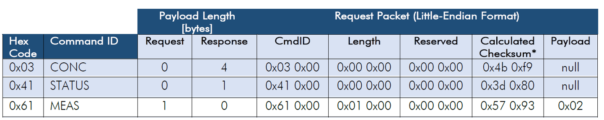
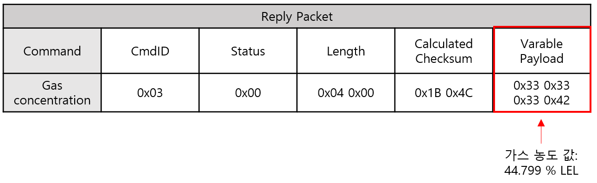
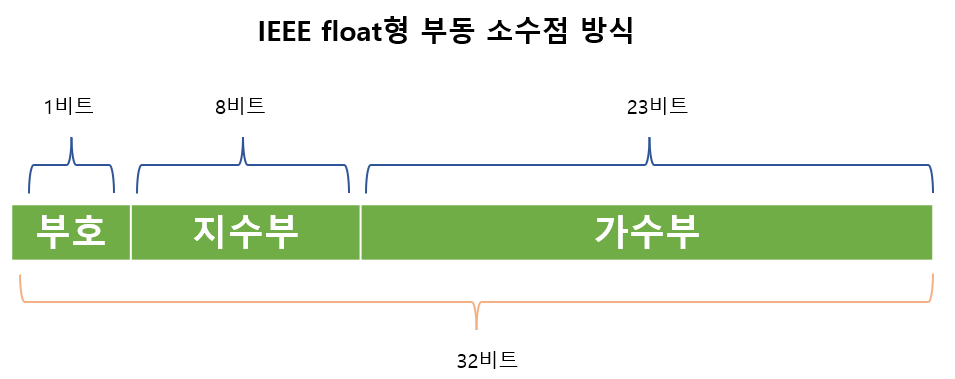
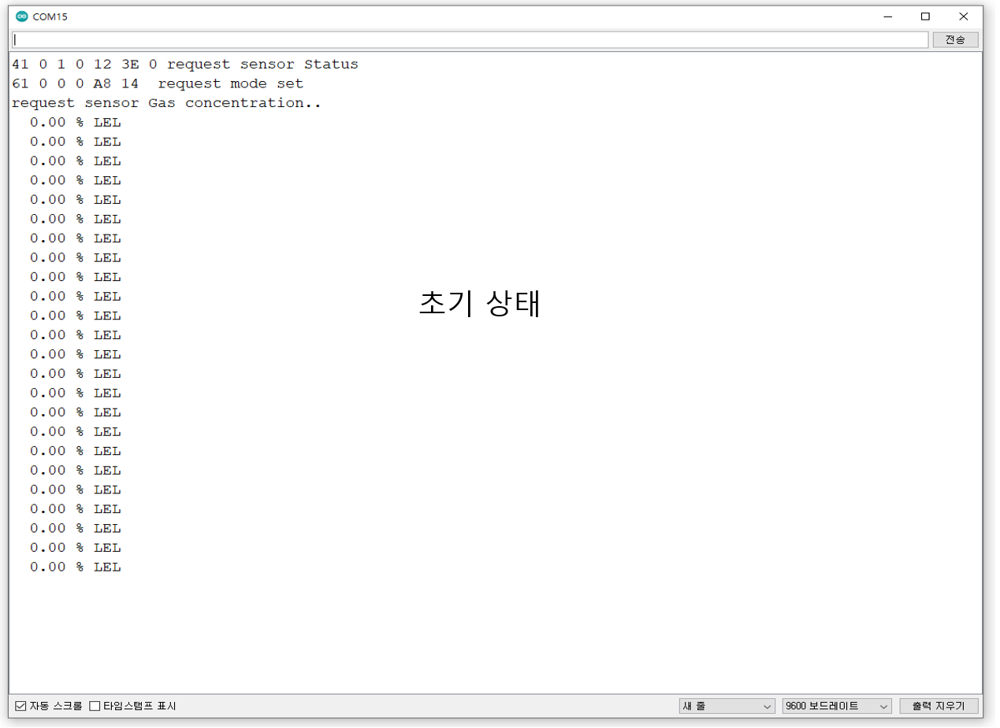
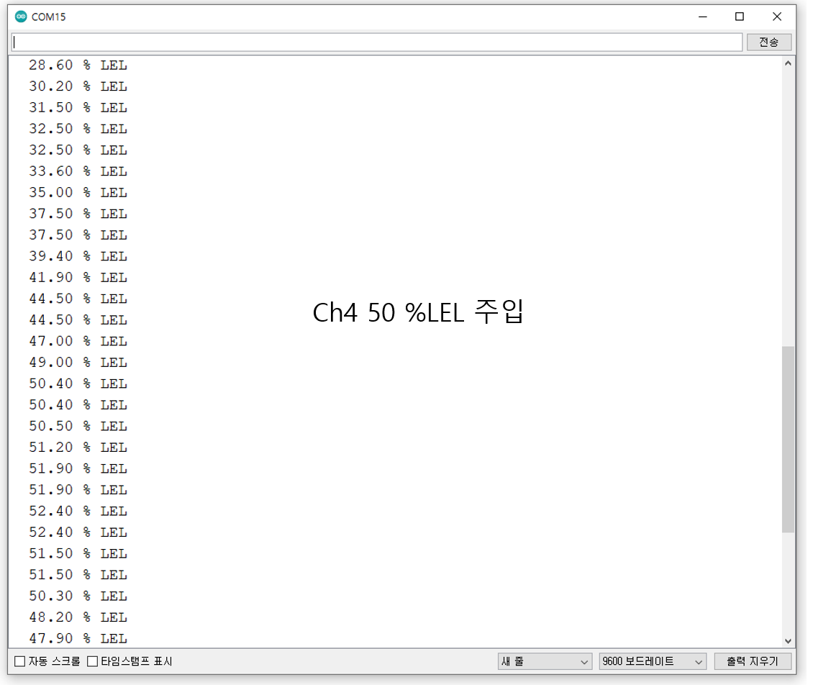

# 가스 농도 값 읽기

## MPS 가스 센서 값 읽기 Sequence

1\. 센서 전원은 켠 후 센서가 부팅될 때까지 기다림(\~3초)

2\. 센서 상태 확인(0x41 Command) – 초기화 완료(0x00)

3\. 연속 측정 모드로 설정(0x61 Command)

4\. 가스 농도 값 요청(0x03 Command)


<figure><figcaption><p>&#x3C; 요청 Command ( 상태 확인, 측정 모드 설정, 가스 농도 요청) ></p></figcaption></figure>

### 가스 농도 값 읽기 응답 예시

<figure><figcaption></figcaption></figure>

* Data Format 방식 : IEEE 754 Format ( 부동소수점), Little Endian 형식(최하위 바이트(LSB)가 먼저 전송)
* 부동소수점: 컴퓨터에서 실수를 표현하는 방법 ( 2진수(0,1)로 표현)

<figure><figcaption></figcaption></figure>

* 부호: 양수일 때 0, 음수일때 1
* 지수부: 8비트, 지수를 나타냄
* 가수부: 23비트, 가수를 나타냄

#### 가스 농도값 부동 소수점 -> 실수 변환 예시

1\.     Variable Payload = 가스 농도 값  = 0x33, 0x33, 0x33, 0x42

2\.     Little endian -> 0x42, 0x33, 0x33, 0x33

3\.     이진수로 변환 -> 0100 0010 0011 0011 0011 0011 0011 0011

4\.       이진수 맨앞자리 0이므로 부호는+, 지수값은 10000100(2) = 132, 127을 기준으로 +5이므로 가수부에 2^5 을 곱해야됨

(즉 지수부에 2진수 값을 계산하여  bias인 127을 빼준 값(n)을 가수부에  2^5 을 곱하면 됨)

5\.       1.01100110011001100110011(2) × 2^5 = 101100.110011001100110011(2) = 44.79999923706055

&#x20;

* &#x20;IEEE 754 부동소수점 변환 [사이트](https://t.hi098123.com/IEEE-754)


가스 농도 읽기 code (Arduino uno)

※     아래의 Code는 Sensor의 간단한 통신 Test 목적으로 작성하였음




```cpp
#include <SoftwareSerial.h>
SoftwareSerial mySerial(12, 13); //Uno Rx Tx (13 12) = mySerial
byte ch4_tx_status[9] = {0x41,0x00,0x00,0x00,0x00,0x00,0x3d,0x80,0x00};
byte ch4_tx_mode_set[9] = {0x61,0x00,0x01,0x00,0x00,0x00,0x57,0x93,0x02};
byte ch4_tx_gas_concentration[9] = {0x03,0x00,0x00,0x00,0x00,0x00,0x4b,0xf9,0x00};
void Status_confirm();
void mode_setup();
void gas_concentration_request();
unsigned int ch4_command_step = 0;
void setup() {
  Serial.begin(9600); //시리얼 통신 초기화
  delay(3000); // 센서 초기화 보통 3초, 최대 10cycle(~20초)   
  while(!mySerial){} //시리얼 통신 포트가 연결되기 전까지 대기
  mySerial.begin(38400);  
  delay(50); 
}
void loop() 
{
    switch (ch4_command_step)
    {
    case 0: Status_confirm(); break;
    case 1: mode_setup(); break;
    case 2: gas_concentration_request(); break;
    default:  break;
    }
}
void Status_confirm()
{
  unsigned char Status_data_check[7] = {0}; 
  mySerial.write(ch4_tx_status, 9); // ch4 status request 
  delay(500);
  static int status_flag = 0;
  while(mySerial.available()>0){ //수신받은 데이터가 0 초과, 즉 데이터가 존재한다면 코드수행
  int ch = mySerial.read(); //시리얼 데이터를 정수형 ch에 저장
  Status_data_check[status_flag] = ch;
  Serial.print(ch, HEX); //시리얼 모니터에 입력받은 데이터 출력
  Serial.print(' ');
  status_flag += 1;
    if((Status_data_check[0] == 0x41) && (Status_data_check[1] == 0x00)&& (sta-tus_flag == 7) ) {Serial.println("request sensor Status "); ch4_command_step = 1; }
  }
  delay(1000);
}
void mode_setup()
{
  unsigned char mode_data_check[6] = {0}; 
  mySerial.write(ch4_tx_mode_set, 9); // ch4 mode request 
  delay(500);
  static int mode_flag = 0; 
  while(mySerial.available()>0){ //수신받은 데이터가 0 초과, 즉 데이터가 존재한다면 코드수행
  int ch = mySerial.read(); //시리얼 데이터를 정수형 ch에 저장
  mode_data_check[mode_flag] = ch;
  Serial.print(ch, HEX); //시리얼 모니터에 입력받은 데이터 출력
  Serial.print(' ');
  mode_flag += 1;
  if((mode_data_check[0] == 0x61) && (mode_data_check[1] == 0x00)&&(mode_flag==6) ) {
    ch4_command_step = 2;  Serial.println(" request mode set"); Seri-al.println("request sensor Gas concentration..");delay(2000);}
  }
}
void ch4_sensor_read();
  unsigned char gas_concentration_data_check[10] = {0};
void gas_concentration_request()  
 
{
  mySerial.write(ch4_tx_gas_concentration, 9); // ch4 gas concentration request 
  delay(500);
  static int gas_concentration_flag = 0; 
  while(mySerial.available()>0){ //수신받은 데이터가 0 초과, 즉 데이터가 존재한다면 코드수행
  int ch = mySerial.read(); //시리얼 데이터를 정수형 ch에 저장
  gas_concentration_data_check[gas_concentration_flag] = ch;
  if(gas_concentration_data_check[0] == 0x03){
    gas_concentration_flag += 1;
  if(gas_concentration_flag == 10){
     if(gas_concentration_data_check[1] == 0x00){
      ch4_sensor_read();
    }
    gas_concentration_flag = 0; }
  }
  else{
    gas_concentration_flag = 0;
  }
  delay(100);
  }
}
void ch4_sensor_read()
{
  float ch4_sensor_value_read = 0;
  // IEE 754 floating point
      union {
        char ch4_value_hex[4];
        float ch4_float_value;
    } ch4_read_to_float;

    ch4_read_to_float.ch4_value_hex[3] = gas_concentration_data_check[9];
    ch4_read_to_float.ch4_value_hex[2] = gas_concentration_data_check[8];
    ch4_read_to_float.ch4_value_hex[1] = gas_concentration_data_check[7];
    ch4_read_to_float.ch4_value_hex[0] = gas_concentration_data_check[6];
    ch4_sensor_value_read = ch4_read_to_float.ch4_float_value;
    Serial.print("  ");
    Serial.print(ch4_sensor_value_read);
    Serial.println(" % LEL ");
}

```



<figure><figcaption></figcaption></figure>

<figure><figcaption></figcaption></figure>


