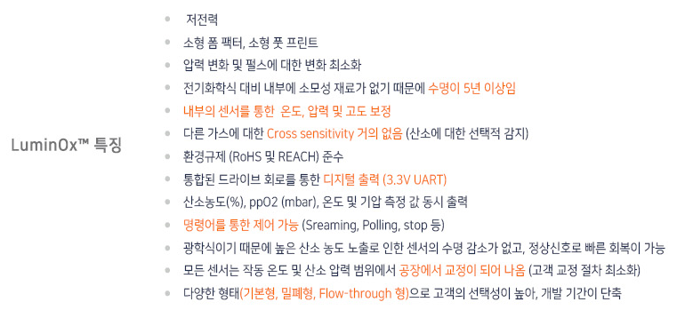
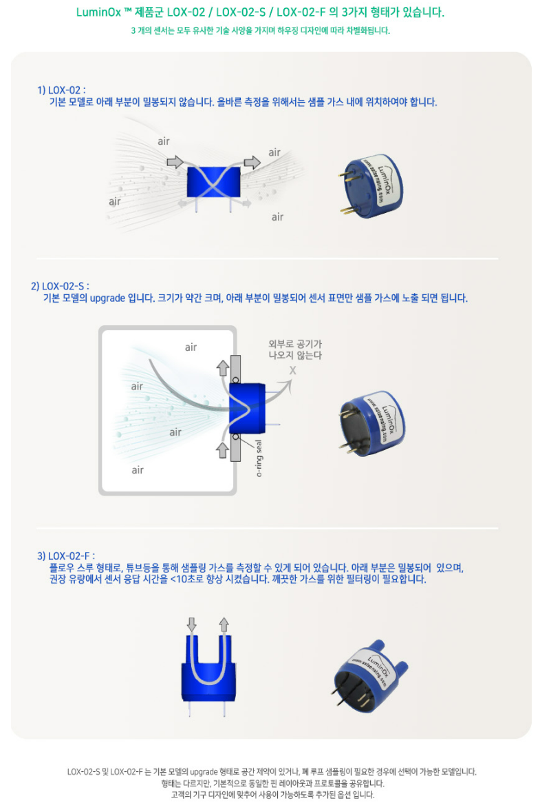
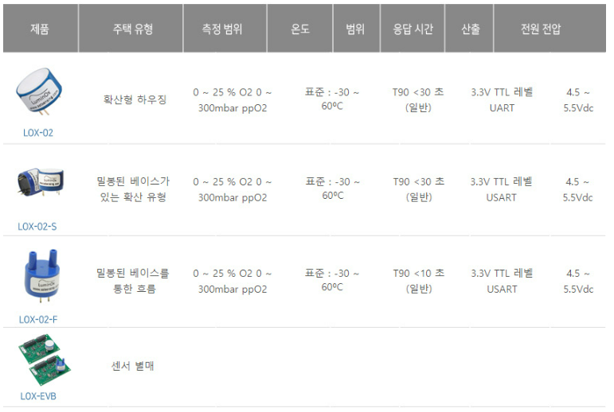

# SST

영국 스코틀랜드에 위치하고 있고 가스 및 액체를 위한 다양한 센서와 시스템을 설계, 제조 및 맞춤제작을 형성하고 있습니다.

SST는 5년 이상의 수명, 디지털 센서, REACH, RoHS를 공통적으로 갖추고 준수하고 있습니다. SST는 각 단계에 대해 새로운 하드웨어 모듈을 생성할 필요 없이 Arduino, PCB, Sensor만 갖추고 있으시다면 신속한 Gas 측정이 가능합니다.

| LOX-O2                                          | LOX-O2-S                                    | LOX-O2-F                                    |
| ----------------------------------------------- | ------------------------------------------- | ------------------------------------------- |
| ​​ | ​​ | ​​ |

<figure><figcaption></figcaption></figure>

<figure><figcaption></figcaption></figure>

<figure><figcaption></figcaption></figure>


[lox\_o2\_s](lox\_o2\_s/)


