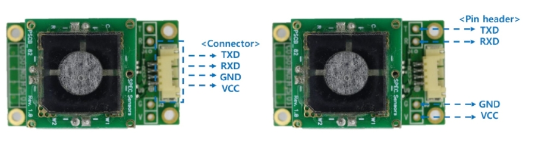
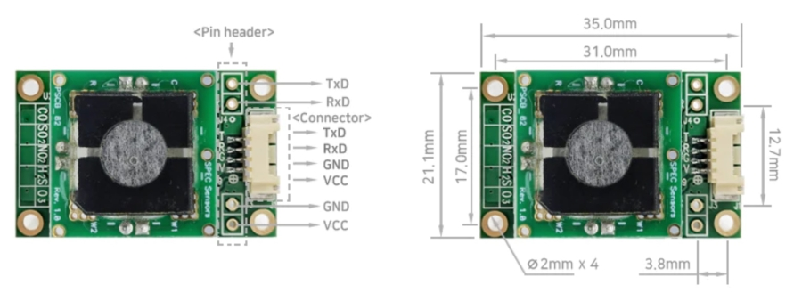
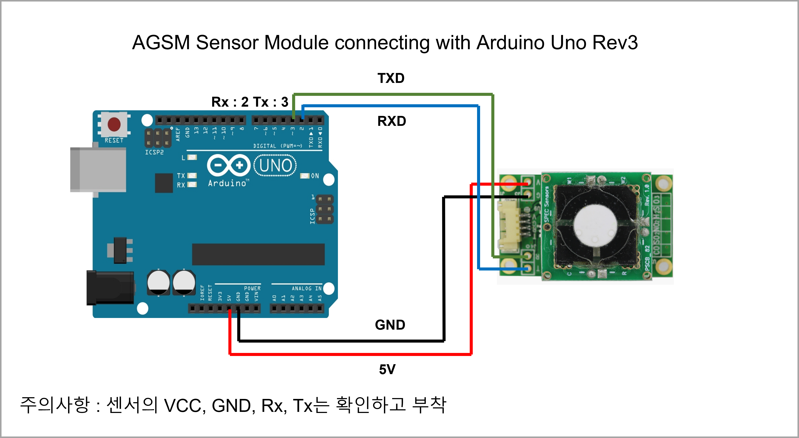
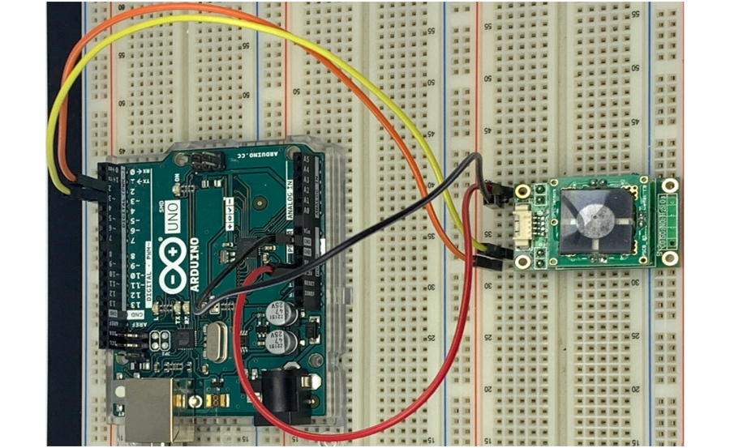
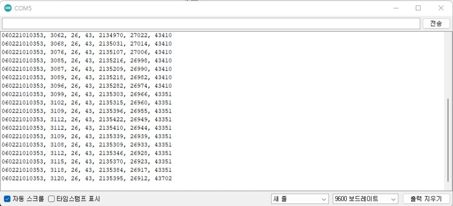
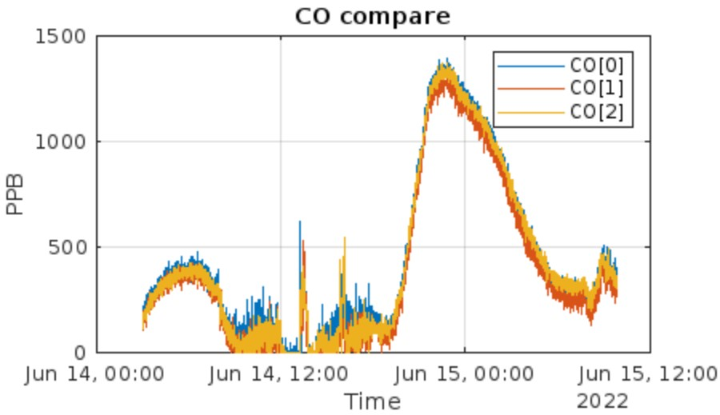

# AGSM CO


## **모듈 사양**

| 측정 가스(Detection Gas)         | CO                                                                                                      |
| ---------------------------- | ------------------------------------------------------------------------------------------------------- |
| 동작 방식(Operating Principle)   | 고체 전해질 전기화학식(3전극)                                                                                       |
| 측정 범위(Measurement Range)     | 0\~100ppm                                                                                               |
| 측정 한계(Low Detection Limit)   | 0.1ppm(100ppb)                                                                                          |
| 분해능 (Resolution)             | 0.001ppm(1ppb)                                                                                          |
| 정확도(Accuracy)                | <5% @ Full Range                                                                                        |
| 응답 시간(T90 response time)     | <150 sec                                                                                                |
| 통신 출력(Communication output)  | <p>UART(TTL 3.3V, 5.0V)<br>3.3VDC Power input: 3.3V TTL Level<br>5.0VDC Power input: 5.0V TTL Level</p> |
| Expected Operating Life      | > 5 years (10 years @ 25± 10C; 60 ± 30% RH)                                                             |
| 구동 전압(Input Voltage Range)   | DC 3.3V \~ 5.0V                                                                                         |
| 소모 전력(Power Consumption)     | <p>(1 Sec 주기 데이터 송수신 소모 전력)<br>Average: 1.13mA at 3.3VDC(3.7mW)<br>Max 1.17mA at 3.3VDC</p>             |
| 제품 크기(Dimension)             | <p>Size: L X W X H(35 x 21.1 mm x 11.8mm)<br>높이: 11.8mm(센서 소켓 적용, 표준 제품)<br>8mm(센서 소켓 미적용, 사용자 요청)</p>  |
| 환경(Environmental)            | <p>구동 온도(Operating Temperature)-20 to 40 °C<br>구동 습도(Operating Humidity Range) 15 to 95%</p>            |
| Based on Standard Conditions | 25 ºC, 50% RH and 1 atm                                                                                 |

## **제품 크기 및 핀 설명**

### 핀 연결(Pin Connection)

* Connector(default): Molex 53261, Yeonho 12505WR
* Pin header(option): 2.54 pitch(V:VCC, G:GND, R: RXD, T: TXD)

<figure><figcaption><p>AGSM CO PIN Connection</p></figcaption></figure>

### 모듈 크기

* Size: L X W (35 x 21.1 mm),
* 높이: 11.8mm(센서 소켓 적용, 표준 제품), 8mm(센서 소켓 미적용, 사용자 요청)
* 2mm기구 홀: 4EA

<figure><figcaption></figcaption></figure>

## **통신 프로토콜**

### 기본 설정(Basic setting)

* TTL level: DC 3.3 V or 5.0V
* Baud: 9600
* Data bits: 8
* Stop bits: 1
* Parity: None

### 통신 명령어(Communication command)

| Command   | 기능(Function)                                                                                                                                      |
| --------- | ------------------------------------------------------------------------------------------------------------------------------------------------- |
| \r, \<CR> | 한번의 데이터 출력(Once Data output) Output: SN \[XXXXXXXXXXXX], PPB \[0 : 999999],TEMP \[-99 : 99], RH \[0 : 99], ADC\[ADCCount], TempDigital, RHDigital |
| C\r, c    | 연속 데이터 출력(CONTINUOUS data output) 재 구동 후 초기화 되며 내부 메모리에 상태 정보가 저장되지 않음                                                                            |
| Z         | 제로 교정(Zero user calibration)센서 출력이 0ppm이 되도록 센서 값을 다시 계산하여 교정                                                                                     |
| B         | 센서 바코드 정보 입력(Barcode entry)센서에 기록된 바코드 정보를 입력                                                                                                     |
| S         | 스팬 교정(Span user calibration)교정 가스를 주입하여 센서의 측정 감도를 다시 계산하여 교정(PPM기준)                                                                              |
| e         | 메모리 정보 확인(Internal memory readout) 모듈 내부 저장된 설정 정보 값을 확인                                                                                          |
| D         | LED ON/OFF 내부 메모리에 상태정보가 저장되지 않음                                                                                                                  |
| r         | System reset                                                                                                                                      |

### 통신 명령어 예시(Communication command example)

```c
'\r'
081821011255, 212, 23, 18, 2194921, 23490, 18665

‘C\r'
‘c\r'
081821011255, 212, 23, 18, 2194921, 23490, 18665

'S’
Enter span gas value in PPM: xxx.xx\r(Enter span gas value in PPM: 4.50\r)
Setting span...
done

'Z'
Setting zero...
done

'B'
Remove Sensor and Scan:
Setting OC...done

'e'
Serial Number= 112020010530
Barcode= 081821011255 110507 NO2 2108 -28.57
ADC Zero= 2165186
ADC_SpanCalValue= 1890818
Temperature Zero(x1000)= 24366
Humidity Zero(x1000)= 16797
Temperature Span(x1000)= 24205
Humidity Span(x1000)= 17139
Calibration GAS(x100)(ppm)= 250
Calibration InA(x100)= -2857
Max Range(ppm)= 5
NoneSensorADC Zero= 2165186
Firmware Version= 2022-03-23B-04”

‘r\r'
reset

‘D\r'
LED OFF
LED ON
```

## **Arduino Example**

<figure><figcaption><p>Arduino Connection</p></figcaption></figure>

<figure><figcaption></figcaption></figure>

### Arduino Code

```cpp
#include <SoftwareSerial.h>
 
#define ContinueMode 0
#define PollingMode 1
 
const int rxPin = 2;
const int txPin = 3;
SoftwareSerial Serial1(rxPin, txPin);
 
void setup()
{
  Serial.begin(9600);
  Serial1.begin(9600);//AGSM sensor module connection
  delay(1000);
 
  #if ContinueMode
  Serial.println("Continuous Mode");
  #else if PollingMode
  Serial.println("Polling Mode");
  #endif
  Serial.println("Serial, Conc.(PPB), Temp.(C), Rh(%), Adc.(Counts), Temp.(Counts), Rh(%Counts)");
  #if ContinueMode
  Serial1.write('c');
  Serial1.write('\r');
  #endif
}
 
void loop()
{
  #if PollingMode
    Serial1.write('\r');
    delay(1000);
  #else
    delay(100);
  #endif
  /*
  read from AGSM port, send to Serial port to interupt 
  continuous output send 'c''/r' without line ending, may have to send more than once.
  */
   while (Serial1.available()) 
  {
   int inByte = Serial1.read();
   Serial.write(inByte);   
  }
}
```

### **Serial Monitor**

<figure><figcaption></figcaption></figure>

## **ThingSpeak Live Graph Link**

<figure><figcaption></figcaption></figure>


