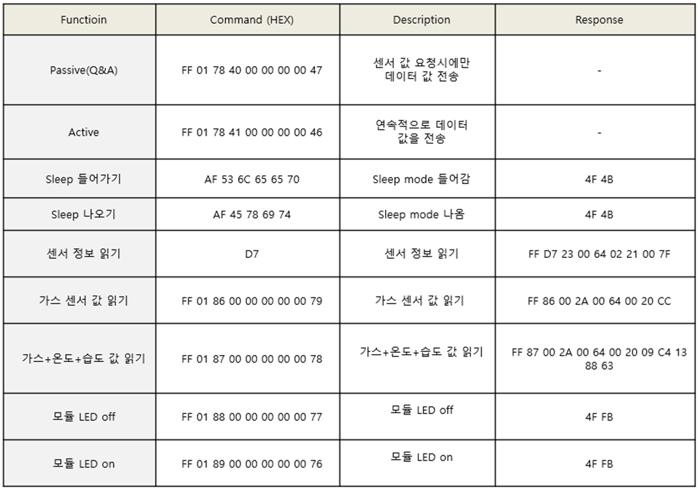

# O2

<figure><figcaption></figcaption></figure>

무연 납(Lead-Free) 산소 센서와 보통 납(Standard lead) 산소 센서 비교 표

<figure><figcaption></figcaption></figure>

* 무연 납(Lead-Free) 산소 센서는 보통 납 센서(Lead-Free)에 비해 더 많은 전력을 사용하므로 보통 충전식 배터리와 같이 사용됨

## 보통 납(Standard lead) 산소 센서

<figure><figcaption></figcaption></figure>

참고: 이 센서는 자체 생성 전압이므로 작동하는데 외부 전압 소스가 필요하지 않음, 일반적으로 출력 전류가 매우 작기 때문에 opamp를 통하여 전압을 증폭시키는데 위 회로에서 전압 증폭 비율은 R1, R2가 결정함

ex) O2 센서의 출력 전류: 0.1mA, R1=10K , R2 = 270K

&#x20;  \- U1.1(+) V = 0.1mV\*100 = 0.01V

* CHANNEL SIGNAL OUT = U1.1 (+)V \* ((R2/R1)+1 ) = 0.01V \* ((270K/10K)+1 ) = 0.28V&#x20;

## 무연납(Lead-Free) 산소 센서

<figure><figcaption></figcaption></figure>

