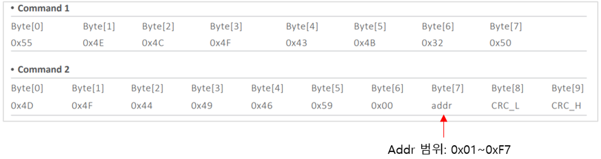

# 통신 프로토콜

UART Modbus-RTU

* UART 설정

| PARAMETER      | TYP        |
| -------------- | ---------- |
| Signal Voltage | 3.3V       |
| Baud Rate      | 115200 bps |
| Data Bits      | 8          |
| Parity         | None       |
| Stop Bits      | 1          |

* 전송 모드:  Modbus-RTU
* Slave address: 01
* 데이터 읽기 및 쓰기 interval : 1초 이상

통신 프로토콜 Function Command

| Function | Description |
| -------- | ----------- |
| 0x03     |  레지스터 읽기    |
| 0x06     | 단일 레지스터 쓰기  |
| 0x10     | 다중  레지스터 쓰기 |

&#x20;

* 모듈 Address 변경

\- 센서의 모듈의 주소를 변경할 경우 단일 제품의 주소를 하나씩 수정해야 됨

<figure><figcaption></figcaption></figure>

