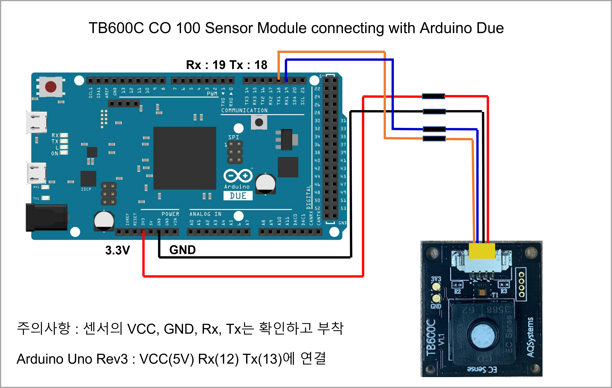
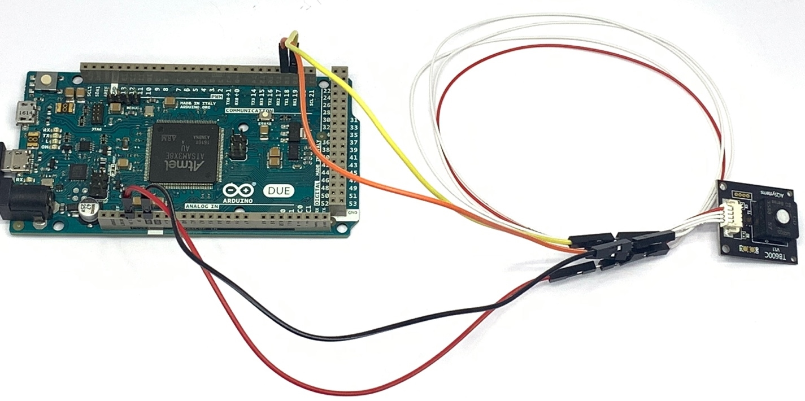
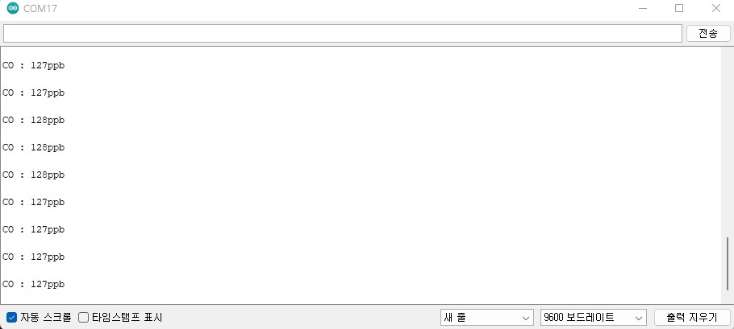
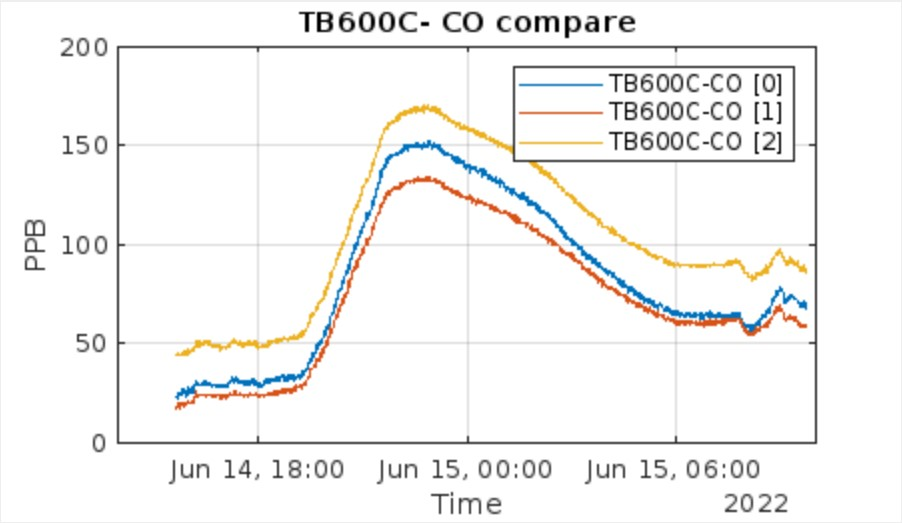

# TB600 CO 100


#### 제품 사양

<table><thead><tr><th>항목</th><th>내용</th><th data-hidden></th></tr></thead><tbody><tr><td>측정 범위</td><td>0-100ppm</td><td></td></tr><tr><td>센서 감지</td><td>Type 1) CO Type 2) 온도(-20 - 55℃) Type 3) 습도(15%-95% RH)</td><td></td></tr><tr><td>응답 및 제로 리턴 시간</td><td>Type 1) 응답 시간 : 3초 Type 2) 제로 리턴 시간 : 2분</td><td></td></tr><tr><td>통신 방식</td><td>3.3V UART</td><td></td></tr><tr><td>전원 전압</td><td>3.3-5.5VDC</td><td></td></tr><tr><td>전력 소비량</td><td>25mW</td><td></td></tr><tr><td>센서 치수 및 무게</td><td>L x W x H(23mm x 25.5mm x 10.2mm), Weight(3.1g)</td><td></td></tr><tr><td>센서 수명</td><td>5년</td><td></td></tr><tr><td>센서 적용 애플리케이션</td><td>배터리 및 IoT 애플리케이션 적합</td><td></td></tr><tr><td>센서 디자인</td><td>RoHS 승인</td><td></td></tr></tbody></table>

#### [Datasheet](https://ecsense.com/wp-content/uploads/2021/03/TB600C\_CO\_100ppm\_Technical-Specification20200513.pdf)

## 아두이노 연결 방법 및 예제

<figure><figcaption></figcaption></figure>

<figure><figcaption></figcaption></figure>

## 예제 Code(Arduino Base)

```cpp
//Arduino Due Code
byte cmd[9] = {0xFF, 0x01, 0x86, 0x00, 0x00, 0x00, 0x00, 0x00, 0x79}; //PPM 데이터 요청 커맨드
 
void setup() {
  Serial.begin(9600); //시리얼 통신 초기화
  delay(1000); //1초 지연
  while(!Serial){} //시리얼 통신 포트가 연결되기 전까지 대기
  Serial1.begin(9600); //Due Rx Tx (19 18) = Serial1
  Serial.print("CO Gas Test"); 
}
unsigned char data[9] = { 0x00, }; //모든 수를 양수로 값을 저장(0x00~0xFF)
void loop() {
  Serial1.write(cmd, 9); //PPM 데이터 요청 패킷 송신
  delay(500); //0.5초 지연
  int packetIndex = 0; //packetIndex 0으로 초기화
  while(Serial1.available()>0){ //수신받은 데이터가 0 초과, 즉 데이터가 존재한다면 코드수행
    int ch = Serial1.read(); //시리얼 데이터를 정수형 ch에 저장
    Serial.print(ch, HEX); //시리얼 모니터에 입력받은 데이터 출력
    Serial.print(' ');
 
    data[packetIndex] = ch;
    packetIndex += 1;
  }
  Serial.println();
  // 패킷을 모두 수신 후 체크섬을 이용하여 데이터의 유효성을 체크
  if( (packetIndex == 9) &&
      (1 + (0xFF ^ (byte)(data[1] + data[2] + data[3] + data[4] + data[5] + data[6] + data[7]))) == data[8]) //체크섬=1~7자리 데이터를 더하여 8비트 데이터를 생성하고 각 비트를 반전시키고 끝에 1을 더함
    {
       //CO 센서 데이터를 구하여 시리얼 모니터에 출력
       //Serial.print(data[6]);
       //Serial.println(data[7],HEX);
      int CO = (data[6] * 256) + data[7]; //CO 농도 측정값 계산
        Serial.print("CO : ");
        Serial.print(CO);
        Serial.println("ppb");   
       delay(100); 
    }
   }
```

**Serial Monitor**

***

<figure><figcaption></figcaption></figure>

***

**Live Graph Link**

<figure><figcaption></figcaption></figure>



***

***

***

***
