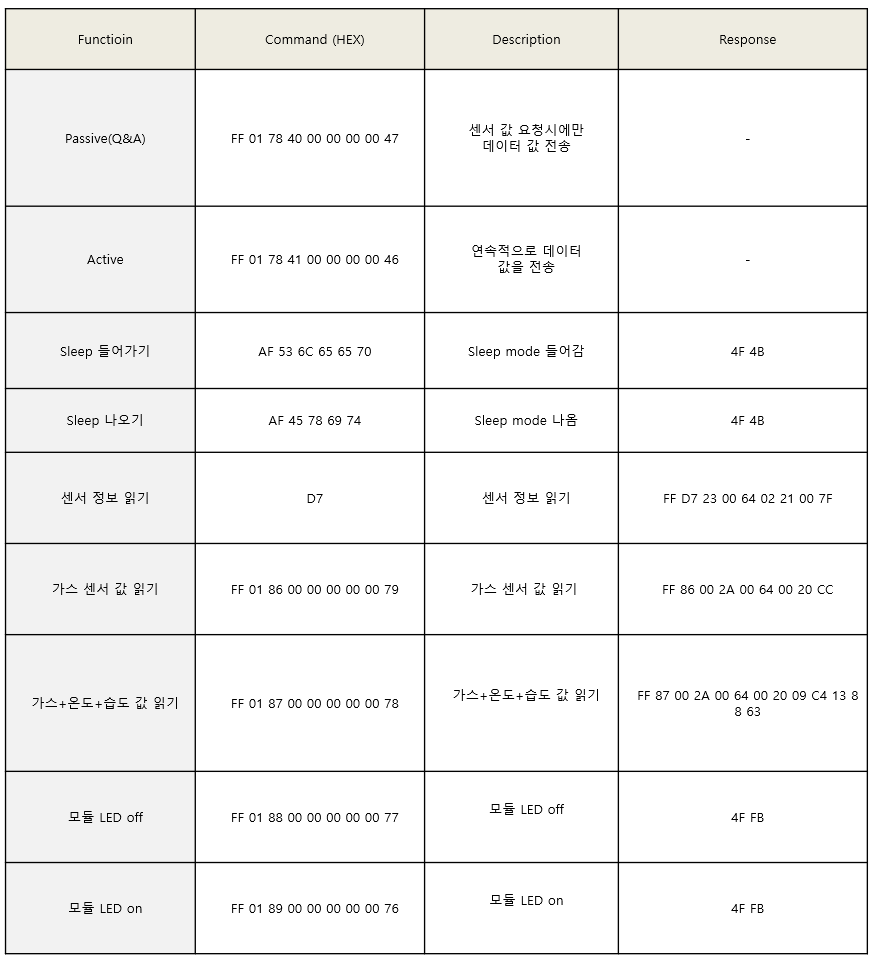
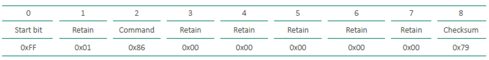

# 통신 프로토콜

* UART 설정

| PARAMETER         | TYP      |
| ----------------- | -------- |
| Baud Rate (Fixed) | 9600 bps |
| Data Bits         | 8        |
| Parity            | None     |
| Stop Bits         | 1        |
| Flow Control      | None     |

* Uart 전체 Command

<figure><figcaption></figcaption></figure>

## &#x20;가스 센서 값 읽기

* 가스 센서 값 읽기 응답:

<figure><figcaption></figcaption></figure>

## 가스 센서 값 + 온습도 값 읽기

| 기 능      | Command (HEX)              |
| -------- | -------------------------- |
| 가스+온도+습도 | FF 01 87 00 00 00 00 00 78 |

* 가스 센서 값 + 온습도 값 읽기 응답:

<figure><figcaption></figcaption></figure>

온도 습도 예제:

Ex) - 0B 24 : 0x0B(11\*256=2816) + 0x24(36) = 2852 / 100 => 28.52 ℃ (온도)

&#x20;\- 06 DB : 0x06(6\*256=1536) + 0xDB(219) = 1755 / 100 => 17.55 %RH (습도)

## &#x20;LED 제어

&#x20;

| 기 능     | Command (HEX)              | Response |
| ------- | -------------------------- | -------- |
| LED off | FF 01 88 00 00 00 00 00 77 | 4F FB    |
| LED on  | FF 01 89 00 00 00 00 00 76 | 4F FB    |

체크섬(Checksum) 설명

&#x20;

<figure><figcaption></figcaption></figure>

Data 1\~7 byte 값을 전부 더 하고 1의 보수를 취하고 1을 더함

Ex.1)

| 
Data 1~7 byte 전부 더함 = 0x01 +0x86 = 0x87 = 1000 0111

= 0111 1000 = 0x78

= 0x78 +1

= 0x79
 |
| ---------------------------------------------------------------------------------------------------------------- |

&#x20;

<figure><figcaption></figcaption></figure>

&#x20;

Ex.2)

| 
Data 1~7 byte 전부 더함 = 0x86 +0x2A+0x20 = 0xD0 = 1101 0000

= 0010 1111 = 0x2f

= 0x2f +1

= 0x30
 |
| --------------------------------------------------------------------------------------------------------------------- |

