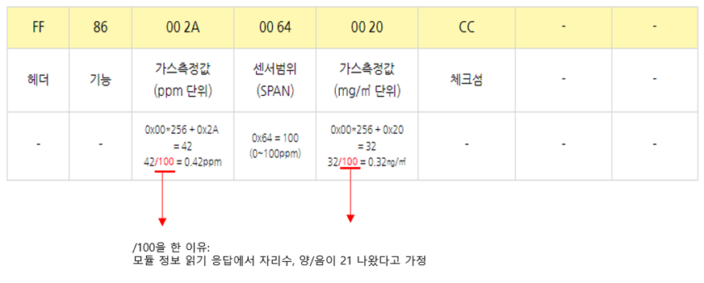

# 모드 설정 및 가스 센서 값 읽기

## Mode 설정

* 초기 Mode default 설정: Passive Mode
* 전원 off 후에도 변경된 통신모드로 저장됨

| Mode          | Command (HEX)              | Description         | Response |
| ------------- | -------------------------- | ------------------- | -------- |
| Passive(Q\&A) | FF 01 78 40 00 00 00 00 47 | 센서 값 요청시에만 데이터 값 전송 |          |
| Active        | FF 01 78 41 00 00 00 00 46 | 연속적으로 데이터 값을 전송     |          |
| Sleep 들어가기    | AF 53 6C 65 65 70          | Sleep mode 들어감      | 4F 4B    |
| Sleep 나오기     | AF 45 78 69 74             | Sleep mode 나옴       | 4F 4B    |

Sleep Mode 나올 경우, 모듈 정상동작에 5초 소요 (5초 동안 data x)

## 가스 센서 값 읽기

* 가스 센서 값 읽기 응답:

<figure><figcaption></figcaption></figure>

## 가스 센서 값 + 온습도 값 읽기

| 기 능      | Command (HEX)              |
| -------- | -------------------------- |
| 가스+온도+습도 | FF 01 87 00 00 00 00 00 78 |

가스 센서 값 + 온습도 값 읽기 응답:
