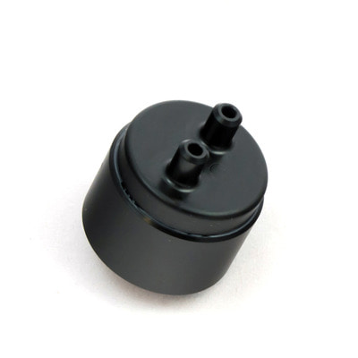
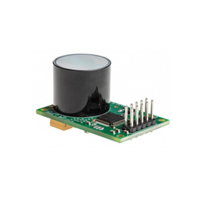
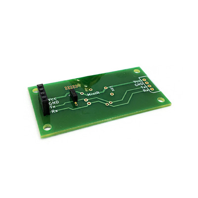

# GSS

## GSS

영국에 본사를 두고 있는 Gas Sensing Solution은 Solid-State NDIR(비분산 적외선) LED 기반 가스 센서의 글로벌 리더입니다. LED와 함께 사용되는 광검출기는 MBE(분자 빔 에픽 택시) 기계를 통해 직접 제조 되며, 특허를 받은 모든 NDIR 확산 CO₂ 센서에 사용이 됩니다.

GSS는 광범위한 고체 NDIR CO₂ 가스 센서를 설계, 개발 및 제조하여 저전력, 고 정확도 및 고속 측정이 필요한 세계 최고의 고객들에게 혁신적인 제품을 제공합니다. GSS는 실내 공기 질 모니터 시스템, 헬스 케어, 우주 항공, 식품 모니터링 및 개인 안전 장비를 포함한 광범위한 시장에 제품을 공급 중입니다.

| CozIR | SprintIR | ExporIR |
| ----- | -------- | ------- |
||||

## GSS QuickStart Guide

**Explain**

: GSS는 디지털 출력인 UART가 공통적으로 포함되어 있고 0℃\~50℃의 온도 범위에서 측정할 수 있는 CO₂ 센서입니다. GSS는 각 단계에 대해 새로운 하드웨어 모듈을 생성할 필요 없이 Arduino, PCB, Sensor만 갖추고 있으시다면 신속한 CO₂ 측정이 가능합니다.

**Main Features**

* CozIR는 3.3mW의 소비 전력을 갖춘 저전력 CO₂ 센서입니다.
* SprintIR은 초 당 20회를 판독하는 고속 측정 CO₂ 센서입니다.
* ExplorIR은 넓은 범위, 급격하게 변화하는 주변 환경에 맞는 CO₂ 센서입니다.

**하드웨어**

: GSS 제품을 시작하는 것은 간단합니다. 가장 먼저 필요한 것은 Arduino 보드, Allsensing 자체 제작 PCB, GSS Sensor, Jumper cable(wire)만 갖추고 있으면 됩니다.

 

**소프트웨어**

* [Arduino IDE 설치](https://www.arduino.cc/en/software)
* [Arduino Due 시작하기](https://www.arduino.cc/en/Guide/ArduinoDue) (Allsensing은 Arduino Due로 하드웨어 및 소프트웨어를 구성했습니다.)
* Arduino 실행 -> Tools -> Board -> Board Manager -> Filter your search 창에 Due를 입력 후 설치

