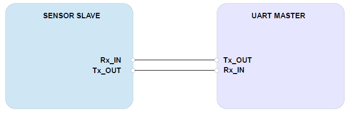
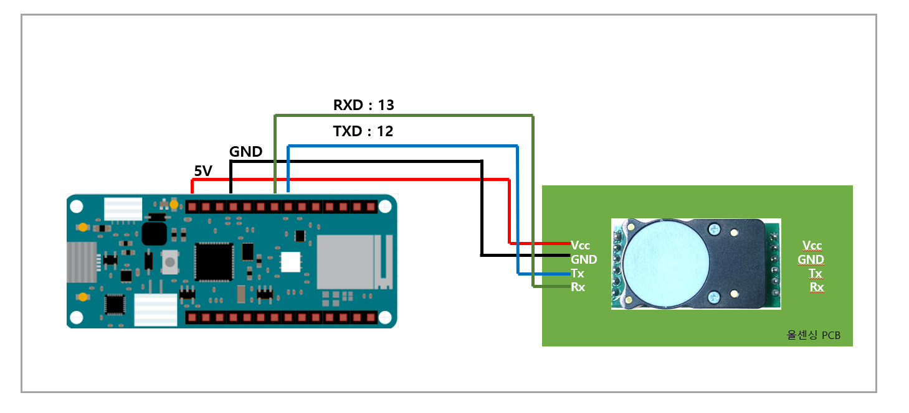
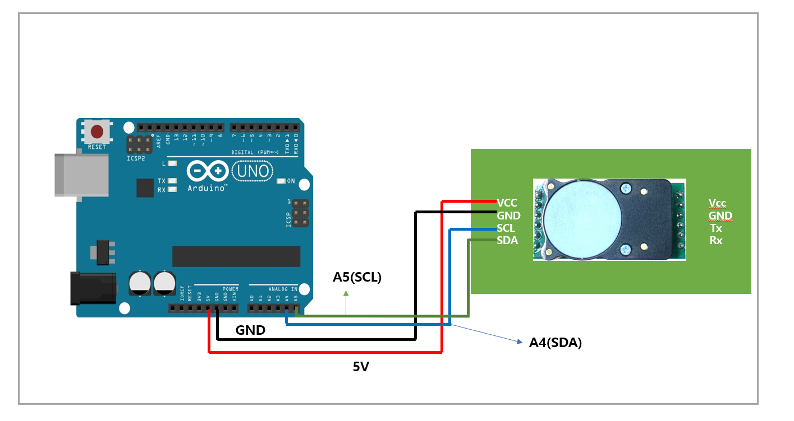
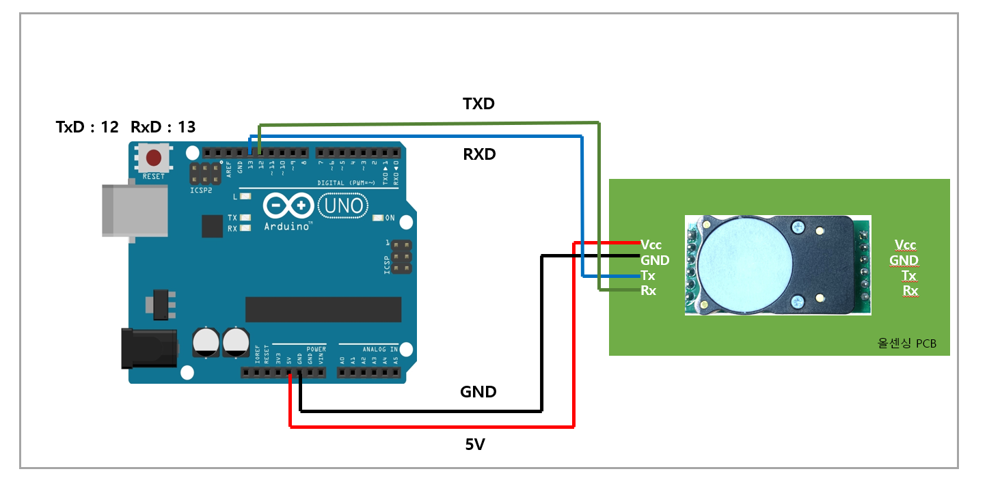

# 디바이스 연결 방법

## Connection DIAGRAM (UART)

<figure><figcaption></figcaption></figure>

## Connection DIAGRAM (I2C)

<figure><figcaption></figcaption></figure>

###



<figure><figcaption></figcaption></figure>



<figure><figcaption></figcaption></figure>



<figure><figcaption></figcaption></figure>



### Arduino Uno와 Cozir-LP2 연결

* I2C

|  항목 | Arduino Uno | Cozir-LP2 |
| :-: | :---------: | :-------: |
| VCC |  5V or 3.3V |    VCC    |
| GND |     GND     |    GND    |
|  TX |      A5     |    SCL    |
|  RX |      A4     |    SDA    |

<figure><figcaption></figcaption></figure>

* UART

|  항목 | Arduino Uno | Cozir-LP2 |
| :-: | :---------: | :-------: |
| VCC |  5V or 3.3V |    VCC    |
| GND |     GND     |    GND    |
|  TX |      13     |     RX    |
|  RX |      12     |     TX    |

<figure><figcaption></figcaption></figure>

### Arduino MKR와 Cozir-LP2 연결

<figure><figcaption></figcaption></figure>

### ESP32와 Cozir-LP2 연결

<figure><figcaption></figcaption></figure>

### ESP8266와 Cozir-LP2 연결

<figure><figcaption></figcaption></figure>
