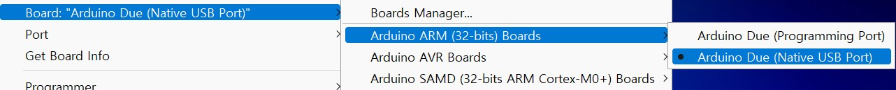
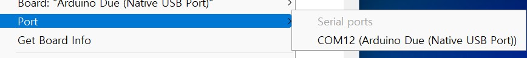

# CozIR-Blink

.jpg>)

## 1.Overview

#### 1)제품 설명

: CozIR-Blink 센서는 최첨단 Solid-State LED 광학기술을 이용한 초 저전력 NDIR CO₂ 센서입니다.

#### 2)제품 특징

* 최대 1% CO₂ 농도 측정
* 솔리드 스테이트, 움직이는 부품 없음, 가열된 필라멘트 없음
* 진동 및 충격에 강하고 비가열성
* 디지털(UART) 및 I2C 출력
* 매우 낮은 전력 및 에너지 소비
* 간편한 계측 통합을 위한 컴팩트한 크기
* 긴 수명, 낮은 유지 보수
* RoHS 준수
* 무선, 휴대용, 웨어러블 및 배터리에 이상적
* 에너지 효율적인 스마트 홈 환경 지원
* IAQ, HVAC, 빌딩 자동화, 계측, 농업, MAP, 자동차, 항공우주 및 안전과 같은 애플리케이션에 쉽게 통합

#### 3)Datasheet

* [Datasheet](https://cdn.shopify.com/s/files/1/0019/5952/files/CozIR-Blink\_DataSheet\_Rev\_4.21.pdf)
* [User Guide](https://cdn.shopify.com/s/files/1/0019/5952/files/CozIR-Blink-User-Guide-Rev-4.5.pdf)
* [치수 도면](https://cdn.shopify.com/s/files/1/0019/5952/files/Mechanical\_Diagram\_-\_CozIR-Blink-CO2Meter.pdf)

## 2.Quickstart

#### 1)전제 조건

: CozIR-Blink를 사용하는 각 단계를 진행하기 전에 아래 나열된 필수 항목을 준비해야 합니다.

**하드웨어**

* CozIR-Blink CO₂ Sensor.
* CozIR용 PCB(Connector 포함 / Allsensing 자체 제작)
* Arduino Due.
* Arduino Jumper Cable Female-male 20cm 4pcs.
* Micro-B USB Cable

**소프트웨어(Arduino IDE를 통한 프로그래밍)**

* [Arduino IDE 설치](https://www.arduino.cc/en/software)
* [Arduino Due 시작하기](https://www.arduino.cc/en/Guide/ArduinoDue)
* Arduino 실행 -> Tools -> Board -> Board Manager -> Filter your search 창에 Due를 입력한 후 설치

 

#### 2)제품 구성

.png>)

 

1. 위 1)그림과 같이 Arduino Due와 PCB 연결(1번:Vcc 2번:GND 24번:Rx 25번:Tx)&#x20;
2. PCB와 CozIR CO₂ Sensor 연결(단, Sensor의 Vcc, GND, Rx, Tx는 확인하고 부착)
3. Arduino Due 뒷면에서 Programming Port와 Native USB Port 중에 Native USB Port에 Micro-B USB Cable을 연결하세요.
4. 사용자님의 Board, Port를 알맞게 설정합니다.

 

5\.  예제 Code를 넣은 후 컴파일 및 시리얼 모니터 확인.

## 3. 예제 Code(Arduino Base)


