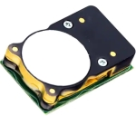

# CozIR-LP2



## 1.Overview

#### 1)제품 설명

: CozIR-LP2는 최첨단 Solid-State LED 광학 기술을 이용한 초 저전력 NDIR CO₂ 센서

#### 2)제품 특징

| 항목         | 내용                                                          |
| ---------- | ----------------------------------------------------------- |
| 측정 범위      | (0-2000ppm), (0-5000ppm), (0-10,000ppm) 최대 10,000ppm 측정 가능  |
| 센서 내부      | Solid-State, 가열된 필라멘트 없음, 움직이는 부품 없음                        |
| 통신 방식      | UART 또는 I²C                                                 |
| 전원 전압      | 3.25-5.5V                                                   |
| 센서 치수 및 무게 | 31mm x 19.5mm x 8.7mm, 2.5g                                 |
| 센서 내구성     | 진동 및 충격에 강하고 비가열성                                           |
| 센서 교정      | 자동 교정 내장                                                    |
| 센서 수명      | 15년                                                         |
| 센서 활용      | IAQ(실내공기질), HVAC(공기조화기술), BMS(건물 관리 시스템), 계측, 농업, 자동차, 항공우주 |

#### 3)Documents

* Datasheet[(PDF링크)](https://cdn.shopify.com/s/files/1/0019/5952/files/CozIR-LP2\_Data\_Sheet\_Rev\_4.10.pdf)
* 치수 도면[(PDF링크)](https://cdn.shopify.com/s/files/1/0019/5952/files/Mechanical\_Diagram\_-\_CozIR-LP2-CO2Meter.pdf)

## 2.Quickstart

#### 1)전제 조건

* CozIR-LP2를 사용하는 각 단계를 진행하기 전에 아래 나열된 항목을 준비 (CozIR-LP2 CO₂ Sensor 중에 Pin이 부착되어 있는 센서는 Allsensing에서 자체 제작한 PCB가 같이 있으면 작업이 더욱 수월)
* 자체 제작 PCB가 필요없고 직접 Soldering을 하시겠다면 가능합니다만, 열을 가하게 된다면 Sensor에 영향을 줄 수 있으니 하루정도 전원을 넣어주면 자동으로 교정
* 소프트웨어는 Arduino IDE를 사용

| **하드웨어**                                                                                                                                                                |
| ----------------------------------------------------------------------------------------------------------------------------------------------------------------------- |
| CozIR-LP2 CO₂ Sensor                                                                                                                                                    |
| [CozIR용 PCB](https://www.allsensing.com/product/detail.html?product\_no=1171\&cate\_no=65\&display\_group=1)(Connector 포함 / Allsensing 자체 제작) -> Soldering보다는 PCB 사용 권장 |
| Arduino Due(3.3V)(Arduino Uno Rev3(5V)도 가능) -> Arduino Due 3.3V 권장                                                                                                    |
| Arduino Jumper wires Female-male 20cm 4pcs                                                                                                                              |
| USB 2.0 Cable Type A/B(Arduino Uno Rev3용)                                                                                                                               |
| USB 2.0 Micro B Cable(Arduino Due용)                                                                                                                                     |

#### 2)환경 구성


1. Arduino Due(or Arduino Uno Rev3)와 PCB를 연결
2. PCB와 CozIR-LP2 CO₂ Sensor를 연결(단, Sensor의 Vcc, GND, Rx, Tx는 확인하고 부착)
3. Arduino Due Port(or Arduino Uno Rev3 Port)와 Micro-B USB Cable(or USB 2.0 Cable Type A/B)를 연결(Allsensing은 Arduino Due Programming Port에 연결)
4. 사용자 Board, Port, Baud-rate(9600)를 알맞게 설정
5. 예제 Code를 넣은 후 컴파일 및 시리얼 모니터를 확인

(Warning : 대부분의 Arduino 보드와 달리 Arduino Due 보드는 3.3V에서 실행, I/O핀이 견딜 수 있는 최대 전압은 3.3V이고 이보다 높은 전압을 적용하면 보드가 손상될 수 있음)

## 3.예제 Code

```arduino
---------------------------Arduino Uno Rev3 Code------------------------------
#include <SoftwareSerial.h>
SoftwareSerial mySerial(12, 13); //Uno Rx Tx (12 13) = mySerial

void setup() {
  Serial.begin(9600); //시리얼 통신 초기화
  mySerial.begin(9600); 
  delay(500); 
  while(!mySerial){} //시리얼 통신 포트가 연결되기 전까지 대기
  mySerial.println("K 2\r\n"); //Polling 모드로 변경
  delay(1000);
  mySerial.println("Z");
}                              

void loop() {
 //수신받은 데이터가 0 초과, 즉 데이터가 존재한다면
 if(mySerial.available()>0) //코드수행
 {
  String str = mySerial.readStringUntil('\n'); //버퍼에서 읽어드린 char의 데이터를 String 형태로 반환
  Serial.println(str); //CO2값 읽기 명령
  delay(1000);  
  mySerial.println("Z"); //CO2값 읽기 명령
  }
 }
}
-------------------------------Arduino Due Code--------------------------------
void setup(){
  Serial.begin(9600); //시리얼 통신 초기화
   Serial1.begin(9600); //DUE Rx Tx (19 18) = Serial1
  delay(500); 
  while(!Serial1){} //시리얼 통신 포트가 연결되기 전까지 대기
  Serial1.println("K 2"); //Polling 모드로 변경     
  delay(1000);
   Serial1.println("Z"); 
}

void loop(){
  //수신받은 데이터가 0 초과, 즉 데이터가 존재한다면
  if(Serial1.available()>0) //코드수행
  {
    String str = Serial1.readStringUntil('\n'); //버퍼에서 읽어드린 char의 데이터를 String 형태로 반환
    Serial.println(str); //CO2값 읽기 명령
    delay(1000); 
    Serial1.println("Z"); //CO2값 읽기 명령
  }
}
```

 

Z:디지털 필터링 후 CO₂ 농도

z:디지털 필터링이 없는 즉각적인 CO₂ 농도

## 4.예제 CozIR-LP2 Monitoring

## 5.참조

* [Sensor Datasheet](https://www.co2meter.com/products/copy-of-cozir-lp-miniature-5-000ppm-co2-sensor)
