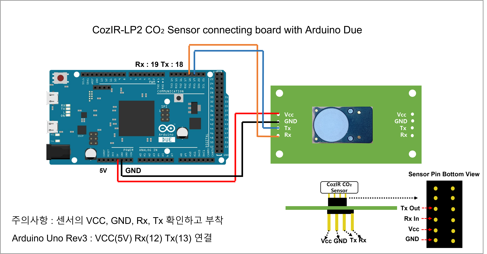
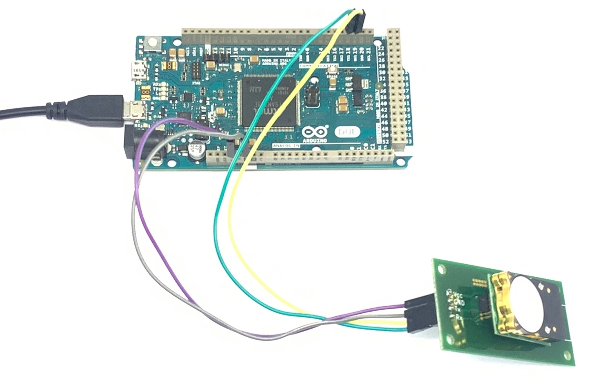
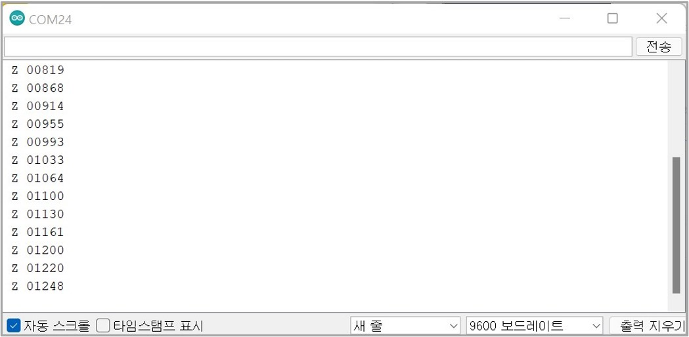

# CozIR-LP2

 (1).jpg>)

## 사양

<table><thead><tr><th>항목</th><th>내용</th><th data-hidden></th></tr></thead><tbody><tr><td>측정 범위</td><td><p>Type 1) 0-2000ppm Type 2) 0-5000ppm Type </p><p>3) 0-10,000ppm 최대 10,000ppm 측정 가능</p></td><td></td></tr><tr><td>센서 내부</td><td>Solid-State, 가열된 필라멘트 없음</td><td></td></tr><tr><td>통신 방식</td><td>UART 또는 I²C</td><td></td></tr><tr><td>전원 전압</td><td>3.25-5.5V</td><td></td></tr><tr><td>전력 소비량</td><td>3.5mW</td><td></td></tr><tr><td>센서 치수 및 무게</td><td>L x W x H(31mm x 19.5mm x 8.7mm), Weight(2.5g)</td><td></td></tr><tr><td>센서 내구성</td><td>진동 및 충격에 강하고 비가열성</td><td></td></tr><tr><td>센서 교정</td><td>자동 교정 기능 내장</td><td></td></tr><tr><td>센서 수명</td><td>15년</td><td></td></tr><tr><td>센서 적용 애플리케이션</td><td><p>IAQ(실내공기질), HVAC(공기조화기술), </p><p>BMS(건물 관리 시스템), 계측, 농업, 자동차, 항공우주</p></td><td></td></tr></tbody></table>


#### Datasheet

* [Datasheet](https://cdn.shopify.com/s/files/1/0019/5952/files/CozIR-Blink\_DataSheet\_Rev\_4.21.pdf)
* [User Guide](https://cdn.shopify.com/s/files/1/0019/5952/files/CozIR-Blink-User-Guide-Rev-4.5.pdf)
* [치수 도면](https://cdn.shopify.com/s/files/1/0019/5952/files/Mechanical\_Diagram\_-\_CozIR-Blink-CO2Meter.pdf)

## 아두이노 연결 방법&#x20;


* CozIR-Blink를 사용하는 각 단계를 진행하기 전에 아래 나열된 필수 항목을 준비해야 합니다. (CozIR-Blink CO₂ Sensor 중에 Pin이 부착되어 있는 센서는 Allsensing에서 자체 제작한 PCB가 같이 있으면 작업이 더욱 수월합니다.)

<figure><figcaption></figcaption></figure>

<figure><figcaption></figcaption></figure>

## 3. 예제 Code(Arduino Base)

```arduino
//Arduino Due Code
void setup(){
  Serial.begin(9600); //시리얼 통신 초기화
   Serial1.begin(9600); //DUE Rx Tx (19 18) = Serial1
  delay(500); 
  while(!Serial1){} //시리얼 통신 포트가 연결되기 전까지 대기
  Serial1.println("K 2"); //Polling 모드로 변경     
  delay(1000);
   Serial1.println("Z"); 
}
 
void loop(){
  //수신받은 데이터가 0 초과, 즉 데이터가 존재한다면
  if(Serial1.available()>0) //코드수행
  { //버퍼에서 읽어드린 char의 데이터를 String 형태로 반환
    String str = Serial1.readStringUntil('\n');
    Serial.println(str); //CO2값 읽기 명령
    delay(1000); 
    Serial1.println("Z"); //CO2값 읽기 명령
  }
}
```


**Serial Monitor**

****

<figure><figcaption></figcaption></figure>

* Z:디지털 필터링 후 CO₂ 농도


**Live Graph Link**

<figure><figcaption></figcaption></figure>




