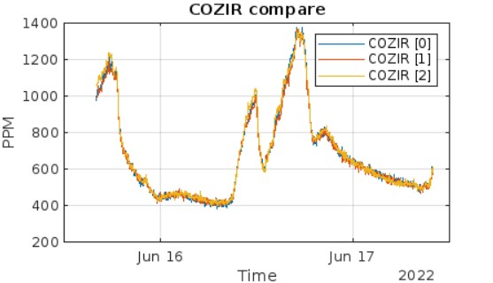

# CozIR-LP2

&#x20;

 (1).jpg>)

## 특징

* 최첨단 Solid-State LED 광학 기술 이용한 초 저전력 NDIR CO2 센서&#x20;
* UART , I2C 디지털 출력
* &#x20;높은 CO2 측정 정확도
* 내장형 자동 영점 조정

## 애플리케이션

* &#x20;난방, 환기 및 공기 조절(HVAC)
* 건물 관리 시스템(BMS)
* 환기 조절 시스템(DCV)
* 차량 내 공기 질
* 무선 장비를 이용한 IoT 및 Smart Technology
* 실내 공기 질(IAQ)
* &#x20;계측
* 농업
* 항공우주

## 사양

<table><thead><tr><th align="center">항목</th><th align="center">내용</th><th align="center"></th><th data-hidden></th><th data-hidden></th></tr></thead><tbody><tr><td align="center">측정 범위</td><td align="center">
CozIR-LP2-2000: 0-2000ppm

CozIR-LP2-5000 0-5000ppm CozIR-LP2-1: 0-10,000ppm (1%)
</td><td align="center"></td><td></td><td></td></tr><tr><td align="center">센서 내부</td><td align="center">Solid-State, 가열된 필라멘트 없음</td><td align="center"></td><td></td><td></td></tr><tr><td align="center">통신 방식</td><td align="center">UART 또는 I²C</td><td align="center"></td><td></td><td></td></tr><tr><td align="center">전원 전압</td><td align="center">3.25-5.5V</td><td align="center"></td><td></td><td></td></tr><tr><td align="center">소모 전류</td><td align="center">측정 모드: 15mA 절전 모드: 0.01mA</td><td align="center"></td><td></td><td></td></tr><tr><td align="center">응답 시간</td><td align="center">30.5ms</td><td align="center"></td><td></td><td></td></tr><tr><td align="center">센서 치수 및 무게</td><td align="center">L x W x H(31mm x 19.5mm x 8.7mm), Weight(2.5g)</td><td align="center"></td><td></td><td></td></tr><tr><td align="center">센서 내구성</td><td align="center">진동 및 충격에 강하고 비가열성</td><td align="center"></td><td></td><td></td></tr><tr><td align="center">센서 교정</td><td align="center">자동 영점교정 기능 내장</td><td align="center"></td><td></td><td></td></tr><tr><td align="center">센서 수명</td><td align="center">15년</td><td align="center"></td><td></td><td></td></tr><tr><td align="center">헤더 핀 크기</td><td align="center">1.27mm</td><td align="center"></td><td></td><td></td></tr></tbody></table>

## 제품 크기 및 핀 특성

<figure><figcaption></figcaption></figure>

<table><thead><tr><th align="center">PIN</th><th align="center">Function</th><th data-hidden></th></tr></thead><tbody><tr><td align="center">GND</td><td align="center">VSS</td><td></td></tr><tr><td align="center">VDD</td><td align="center">Positive Supply</td><td></td></tr><tr><td align="center">Rx_ In</td><td align="center">Digital Input</td><td></td></tr><tr><td align="center">Tx_out</td><td align="center">Digital Output</td><td></td></tr><tr><td align="center">I2C_ENABLE</td><td align="center">Digital Input</td><td></td></tr><tr><td align="center">I2C_SCL</td><td align="center">I2C clock</td><td></td></tr><tr><td align="center">I2C_SDA</td><td align="center">I2C data</td><td></td></tr></tbody></table>

## UART 통신 프로토콜

* &#x20;UART 설정

### UART COMMAND&#x20;

A) 모드 설정

B) CO2 값 읽기

#### Datasheet

* [Datasheet](https://cdn.shopify.com/s/files/1/0019/5952/files/CozIR-Blink\_DataSheet\_Rev\_4.21.pdf)
* [User Guide](https://cdn.shopify.com/s/files/1/0019/5952/files/CozIR-Blink-User-Guide-Rev-4.5.pdf)
* [치수 도면](https://cdn.shopify.com/s/files/1/0019/5952/files/Mechanical\_Diagram\_-\_CozIR-Blink-CO2Meter.pdf)

* CozIR-Blink를 사용하는 각 단계를 진행하기 전에 아래 나열된 필수 항목을 준비해야 합니다. (CozIR-Blink CO₂ Sensor 중에 Pin이 부착되어 있는 센서는 Allsensing에서 자체 제작한 PCB가 같이 있으면 작업이 더욱 수월합니다.)

**Live Graph Link**

<figure><figcaption></figcaption></figure>



