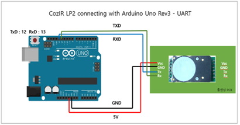
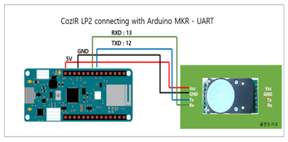
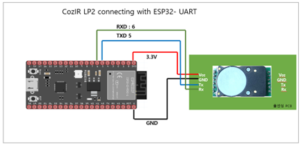
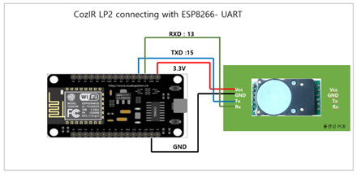

# 디바이스 연결 방법

### Arduino Uno와 ETH-01D 연결

|  항목 | Arduino Uno | Cozir-Lp2 |
| :-: | :---------: | :-------: |
| VCC |  5V or 3.3V |    VCC    |
| GND |     GND     |     GC    |
|  TX |      13     |     RX    |
|  RX |      12     |     TX    |

<figure><figcaption></figcaption></figure>

### Arduino MKR와 ETH-01D 연결

<figure><figcaption></figcaption></figure>

### ESP32-S2와 ETH-01D 연결

<figure><figcaption></figcaption></figure>

### ESP8266-12E와 ETH-01D 연결

<figure><figcaption></figcaption></figure>

