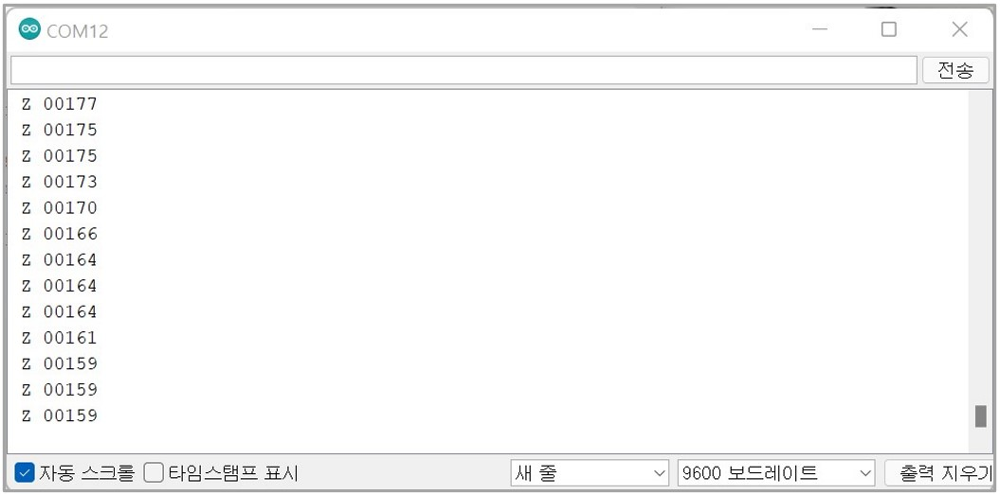

# SprintIR 6S


## 사양

<table><thead><tr><th>항목</th><th>내용</th><th data-hidden></th></tr></thead><tbody><tr><td>측정 범위</td><td>Type 1) 0-5% Type 2) 0-10% Type 3) 0-20% Type 4) 0-60% Type 5) 0-100%</td><td></td></tr><tr><td>센서 종류</td><td>Type 1) Blank : 어댑터 커버 O Type 2) M : 어댑터 커버 X</td><td></td></tr><tr><td>센서 내부</td><td>Solid-State</td><td></td></tr><tr><td>센서 응답 속도</td><td>초 당 20회 판독(0-5%센서)</td><td></td></tr><tr><td>통신 방식</td><td>UART</td><td></td></tr><tr><td>전원 전압</td><td>3.25-5.5V</td><td></td></tr><tr><td>전력 소비량</td><td>3.5mW</td><td></td></tr><tr><td>센서 치수 및 무게</td><td>L x W x H(25mm x 40mm x 31mm), Weight(16g)</td><td></td></tr><tr><td>센서 내구성</td><td>진동 및 충격 방지</td><td></td></tr><tr><td>센서 적용 애플리케이션</td><td>보건의료, 식품 포장, 스포츠 과학</td><td></td></tr><tr><td>센서 교정</td><td>자동 교정 기능 내장</td><td></td></tr><tr><td>센서 수명</td><td>15년</td><td></td></tr></tbody></table>

#### [Datasheet](https://cdn.shopify.com/s/files/1/0019/5952/files/SprintIR-6S\_Data\_Sheet\_Rev\_4.11.pdf)

## 아두이노 연결 방법 및 예제

<figure><figcaption></figcaption></figure>

<figure><figcaption></figcaption></figure>

## 예제 Code(Arduino Base)


```cpp
//Arduino Due Code
void setup(){
  Serial.begin(9600); //시리얼 통신 초기화
   Serial1.begin(9600); //DUE Tx Rx (18 19) = Serial1
  delay(500); //0.5초 delay
  while(!Serial1){}
  Serial1.println("K 2"); //Polling 모드로 변경     
  delay(500);
   Serial1.println("Z"); //CO2값 읽기 명령
}
 
void loop(){
  //수신받은 데이터가 0 초과, 즉 데이터가 존재한다면
  if(Serial1.available()>0) //코드수행
  { //버퍼에서 읽어드린 char의 데이터를 String 형태로 반환
    String str = Serial1.readStringUntil('\n');
    Serial.println(str); //CO2값 읽기 명령
    delay(1000);//1초 delay
    Serial1.println("Z"); //CO2값 읽기 명령
  }
}
```


**Serial Monitor**

<figure><figcaption></figcaption></figure>
