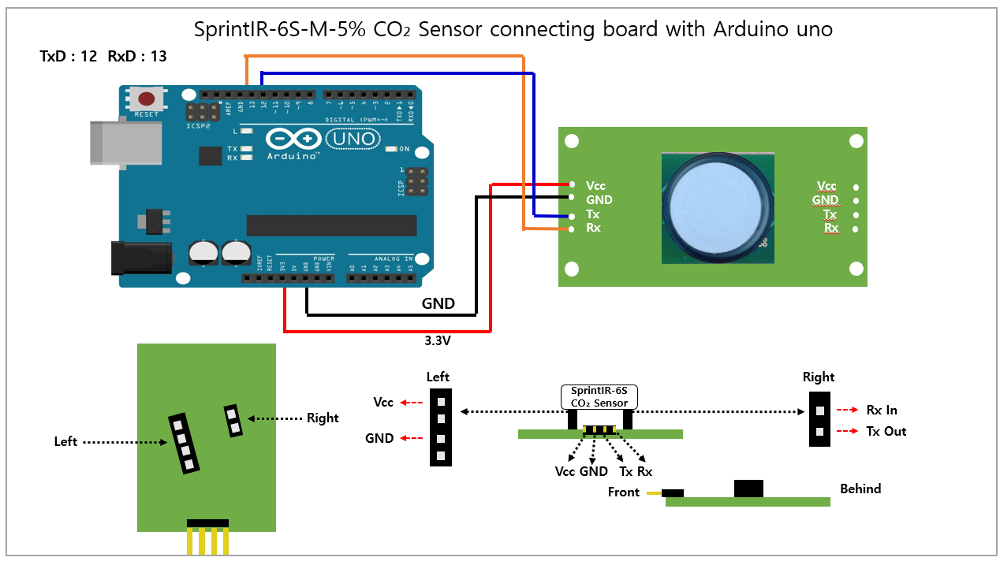
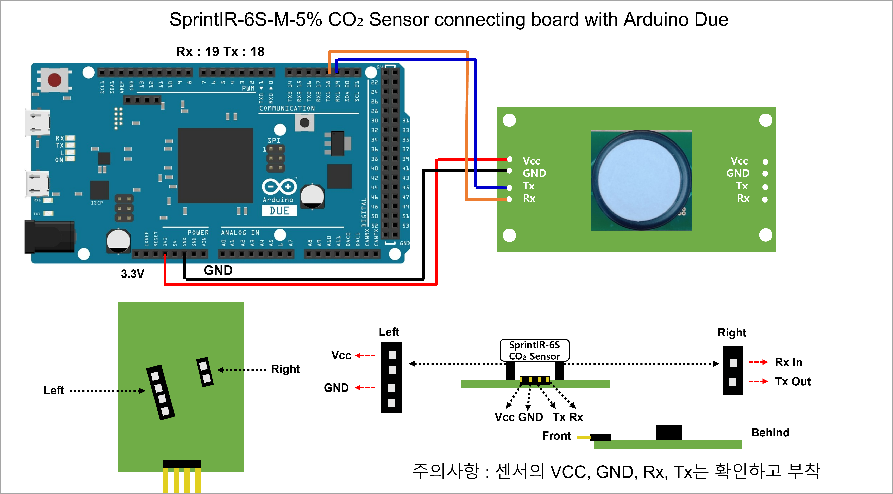
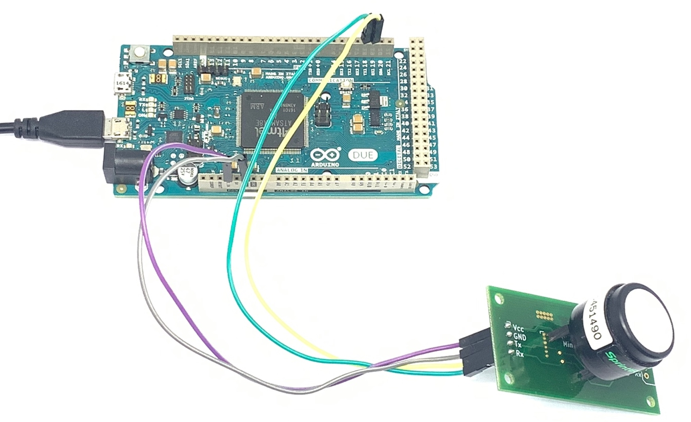
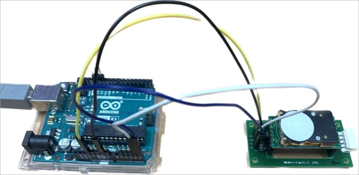

# 디바이스 연결 방법

## Connection DIAGRAM (UART)

<figure><figcaption></figcaption></figure>

## Arudino uno와  SprintIR 연결

|  항목 | Arduino Uno | Cozir-Series |
| :-: | :---------: | :----------: |
| VCC |  5V or 3.3V |      VCC     |
| GND |     GND     |      GND     |
|  TX |      13     |      RX      |
|  RX |      12     |      TX      |

Arduino Uno

<figure><figcaption></figcaption></figure>

Arduino Due

<figure><figcaption></figcaption></figure>

<figure><figcaption></figcaption></figure>

<figure><figcaption></figcaption></figure>

<figure><figcaption></figcaption></figure>

### Arduino MKR와 Cozir-Series 연결

### ESP32와 Cozir-Series 연결

### ESP8266와 Cozir-Series 연결
