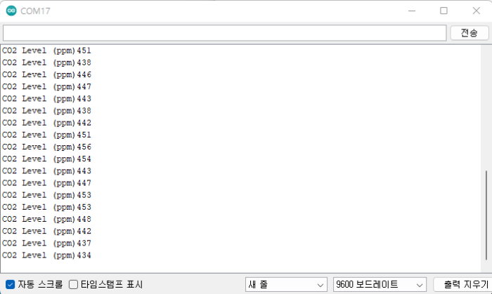
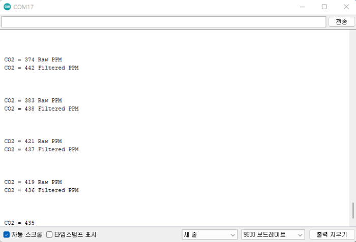

# 인터페이스 유형별(UART,I2C) CO2값 읽기

* I2C

```cpp
#include <Wire.h>
 
void setup() {
  Wire.begin();
  Serial.begin(9600); 
  Serial.println("-Cozir-LP3 I2C Communication-");      
}
 
int reading = 0;
int reading111 = 0;
 
void loop() {
 // Wire.beginTransmission(0x41);                
 // Wire.write(0x02);                 
 // Wire.endTransmission();       
 Wire.beginTransmission(65); // transmit to device #DEVICE ADDRESS 0x41
 Wire.write(2);              // sends one byte #REGISTER 0x02
 Wire.endTransmission();    // stop transmitting
 
  Wire.requestFrom(65, 2); //슬레이브(1)에 2byte 요청
  while (2<=Wire.available()) {
    reading = Wire.read();  // receive high byte (overwrites previous reading)
    reading = reading << 8;    // shift high byte to be high 8 bits    
    reading |= Wire.read(); // receive low byte as lower 8 bits
 
    Serial.print("CO2 Level (ppm)");
    Serial.println(reading);   // print the reading         
  } 
 // Serial.println();     
  delay(1000);
}
```

***

* UART

```cpp
#include <SoftwareSerial.h>
 
SoftwareSerial mySerial(12, 13); // RX, TX pins on Ardunio
 
int co2 =0;
double multiplier = 1;// 1 for 2% =20000 PPM, 10 for 20% = 200,000 PPM
uint8_t buffer[25];
uint8_t ind =0;
uint8_t index =0;
 
int fill_buffer();  // function prototypes here
int format_output();
 
void setup() {
  Serial.begin(9600);
  Serial.print("\n\n");
  Serial.println("             AN128 Ardunio to Cozir CO2 Sensor - Demonstration code 11/29/2017\n\n"); 
  mySerial.begin(9600); // Start serial communications with sensor
  //mySerial.println("K 0");  // Set Command mode
  mySerial.println("M 6"); // send Mode for Z and z outputs
  // "Z xxxxx z xxxxx" (CO2 filtered and unfiltered)
 
  mySerial.println("K 1");  // set streaming mode
 
}
 
void loop() {
  fill_buffer();  // function call that reacds CO2 sensor and fills buffer
 
   //Serial.print("Buffer contains: ");
  for(int j=0; j<ind; j++)
  //Serial.print(buffer[j],HEX);
 index = 0;
 format_output();
  Serial.print(" Raw PPM        ");
 
  index = 8;  // In ASCII buffer, filtered value is offset from raw by 8 bytes
  format_output();
  Serial.println(" Filtered PPM\n\n");
}
 
int fill_buffer(void){
 
 
// Fill buffer with sensor ascii data
ind = 0;
while(buffer[ind-1] != 0x0A){  // Read sensor and fill buffer up to 0XA = CR
  if(mySerial.available()){
    buffer[ind] = mySerial.read();
    ind++;
    } 
  }
  // buffer() now filled with sensor ascii data
  // ind contains the number of characters loaded into buffer up to 0xA =  CR
  ind = ind -2; // decrement buffer to exactly match last numerical character
  }
 
 int format_output(void){ // read buffer, extract 6 ASCII chars, convert to PPM and print
   co2 = buffer[15-index]-0x30;
  co2 = co2+((buffer[14-index]-0x30)*10);
  co2 +=(buffer[13-index]-0x30)*100;
  co2 +=(buffer[12-index]-0x30)*1000;
  co2 +=(buffer[11-index]-0x30)*10000;
  Serial.print("\n CO2 = ");
  Serial.print(co2*multiplier,0);
// Serial.print(" PPM,");
//    Serial.print("\n");
  delay(200);
 }
```

***

**Serial Monitor**

* I2C

<figure><figcaption></figcaption></figure>

* UART

<figure><figcaption></figcaption></figure>


