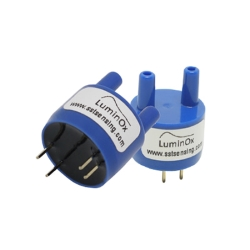

# SST

## SST

영국 스코틀랜드에 위치하고 있고 가스 및 액체를 위한 다양한 센서와 시스템을 설계, 제조 및 맞춤제작을 형성하고 있습니다.

SST의 주요 목표는 고객의 기술 및 사용 센서 요구 사항을 정확히 충족하는 필수 감지 및 제어 솔루션을 고객에게 제공하는 것입니다.

| LuminOx-02                                             | LuminOx-02-F                                      |
| ------------------------------------------------------ | ------------------------------------------------- |
|  (1).jpg>) |  |

 

## SST Sensor

**설명**

:SST는 5년 이상의 수명, 디지털 센서, REACH, RoHS를 공통적으로 갖추고 준수하고 있습니다. SST는 각 단계에 대해 새로운 하드웨어 모듈을 생성할 필요없이 Arduino, PCB, Sensor만 갖추고 있으시다면 신속한 Gas 측정이 가능합니다.

**하드웨어**

:SST 제품을 시작하는 것은 간단합니다. 가장 먼저 필요한 것은 Arduino 보드, Allsensing 자체 제작 PCB, SST sensor, Jumper cable(wire)만 갖추고 있으면 됩니다.

**소프트웨어**

* [Arduino IDE 설치](https://www.arduino.cc/en/software)
* [Arduino Due 시작하기](https://www.arduino.cc/en/Guide/ArduinoDue) (Allsensing은 Arduino Due로 하드웨어 및 소프트웨어를 구성했습니다.)
* Arduino 실행 -> Tools -> Board -> Board Manager -> Filter your search 창에 Due를 입력 후 설치
