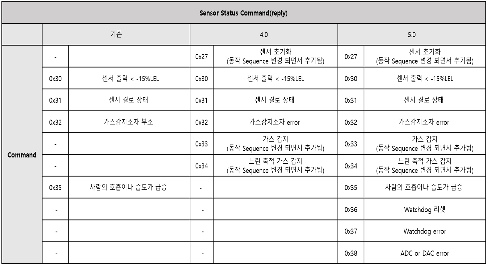
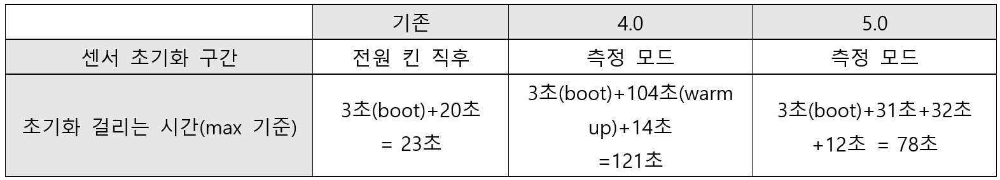
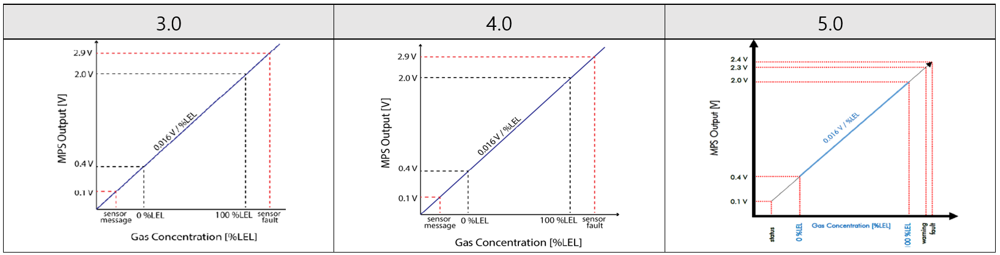
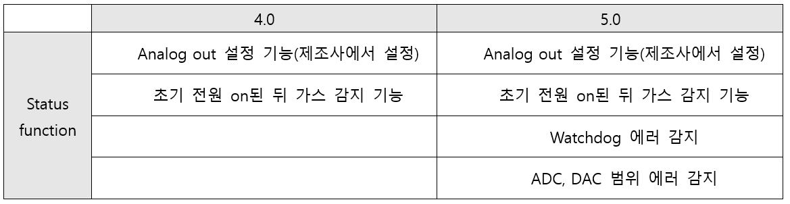

# 3.0/4.0/5.0 Version 변경사항

요약:

(3.0 version -> 4.0, 5.0 version)

1\. UART 통신 - 센서 상태 Command 버전 증가할수록 기능 추가

2\. 동작 Sequence 변경에 따른 센서 초기화 구간 및 시간 변경

3\. Analog - output 5.0에서 2.4V로 변경, 센서 상태 버전 증가할수록 기능 추가

4\. 소모전력 5.0에서 1.7mW 감소함(+3V 기준)

* [MPS Flammable Gas Sensor User Manual](https://nevadanano.com/wp-content/uploads/2023/05/SM-UM-0002-24-MPS-Flammable-Gas-Sensor-User-Manual.pdf)
* [MPS Flammable Gas Sensor 4.0 User Manual](https://nevadanano.com/wp-content/uploads/2023/05/SM-UM-0007-05-MPS-Flammable-Gas-Sensor-4.0-User-Manual.pdf)
* [MPS Flammable Gas Sensor 5.0 User Manual](https://nevadanano.com/wp-content/uploads/2023/05/SM-UM-0010-03-MPS-Flammable-Gas-Sensor-5.0-User-Manual.pdf)

## 1 .Digital (UART)

### &#x20;1.1     Status Command (Hex)

\-       Status Command는 센서에게 특정 Command(ex. 가스 값 요청 Command)를 요청하였을 때 센서에서 현재 센서의 상태를 나타내어 주는 Command임

변경사항:

기존 -> 4.0 Status Command 0x27, 0x33, 0x34 추가, 0x35 삭제 -> 5.0 Status Command 0x35\~0x38 추가

<figure><figcaption></figcaption></figure>

&#x20;

### 1.1     동작 Sequence

\-       Version 변경 후 센서 초기화 구간이 변경되었고, 초기화에 걸리는 시간이 변경됨

<figure><figcaption></figcaption></figure>

* 4.0 warm up(104초) 기간 동안 -100 %LEL 및 ID = 253을 보고하며 가스를 감지함

## 1      Analog

\-       Analog out 3.0과 4.0은 2.9V로 동일하며 5.0은 2.4V로 감소함

<figure><figcaption></figcaption></figure>

* 3.0에서 4.0, 5.0로 upgrade 되면서 센서 상태 확인 추가된 기능

<figure><figcaption></figcaption></figure>

## 1      센서 특징

\-       3.0, 4.0에서 5.0으로 변화하면서 소모전력이 1.7mW 감소함(+3V 기준)
