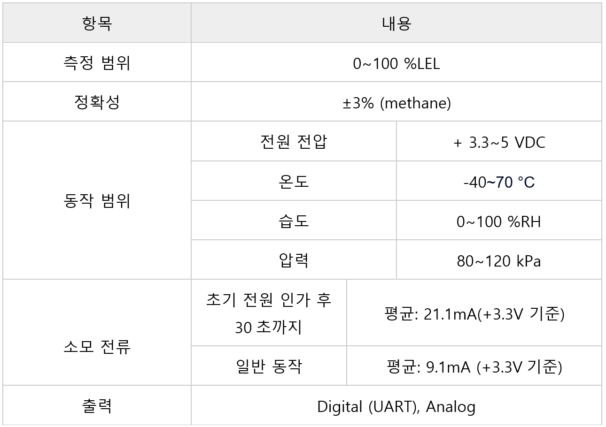

# Nevadanano

* [Nevadanano main page](https://nevadanano.com/)



Nevadanano는 공기 품질 변화에서 가스 경고 시스템에 이르기까지 광범위한 응용 분야를 위한 가스 센서 및 센서 모듈을 개발, 제조 및 배포하며, Allsensing은 DD-Scientific 및 다양한 환경센서를 고객들에게 유통하고 있으며 센서에 대한 올바른 이해와 사용법을 소개하고 있음

MPS Flammable Gas Sensor (3.0 Version)

<figure><figcaption></figcaption></figure>

## 특징

* 수소, 메탄, 프로판, 부탄 등을 포함하여 12가지가 넘는 가장 일반적인 가연성 가스를 동시에 감지
* 드리프트, 부식 또는 독성이 없으며 수명 기간 동안 유지 관리 필요 x
* 실시간으로 결함이 존재하는 지와 그 이유를 즉시 알려줌
* 실시간 환경 보상 내장
* 교정 불필요
* 자체 테스트 내장
* 저전력( 평균 29mW )
* 실시간 자동 가스 분류
* 유지보수 불필요
* 독성에 지속적으로 노출되어도 중독에 대한 면역
* 예상 수명 15년 이상(2년 보증)
* 아날로그 및 디지털 출력

## 애플리케이션

* 냉매 누출 감지( HVAC(난방, 환기, 냉방) Systems – 냉방 조절 )
* 매탄 누출 감지(천연 가스) 모니터링 장치
* 가연성 가스 감지기
* 산업재해, 산불 등 공중 연기 감지

## 사양

<figure><figcaption></figcaption></figure>

#### 감지 가스 목록

<figure><figcaption></figcaption></figure>

* 전체 환경 범위에서 메탄에 정확도(Accuracy) 즉 전체 범위(full scale)에서 오차범위 ±5 %LEL &#x20;

## 제품 크기 및 핀 특성

* MPS Flammable Gas Sensor (S4 series)

<figure><figcaption></figcaption></figure>

* MPS Mini Flammable Gas Sensor

<figure><figcaption></figcaption></figure>

#### MPS sensor ISO 10156 규격과, IEC 60079-20-1 규격

※     MPS Gas sensor는 초기에 ISO 10156 기준으로 제조사에서 교정됨(ISO defualt)

※     ISO (International Organization for Standardization) 국제 표준화 기구, IEC (International Electrotechnical Commission) 국제전기기술위원회

<figure><figcaption></figcaption></figure>

* 가연성 가스의 % Vol, % LEL, PPM 사이의 관계: 5.0 % VOL=100 % LEL=50000PPM
* 메탄(methane)의 경우 ISO 10156 규격일 경우 100 %LEL일때 5.0 % VOL = 50000PPM, IEC 60079-20-1 규격일 경우 100 %LEL일때 4.4 % VOL = 약 44014PPM , 즉 ISO 규격과 IEC 규격의 차이는 약 1.136배수 차이가 발생함( 4.4% \* 1.136 = 4.9984 = 약 5%)

ex) methane IEC, ISO 각각  50 %LEL 주입 시 농도 비교



<figure><figcaption></figcaption></figure>



<figure><figcaption></figcaption></figure>



#### 메탄(methane) 가스 정확도

<figure><figcaption></figcaption></figure>

