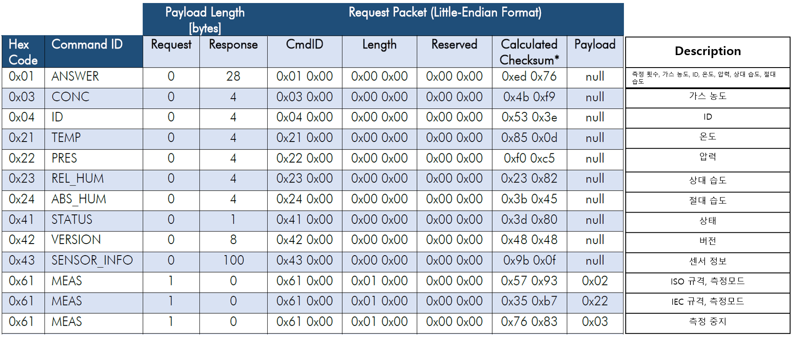
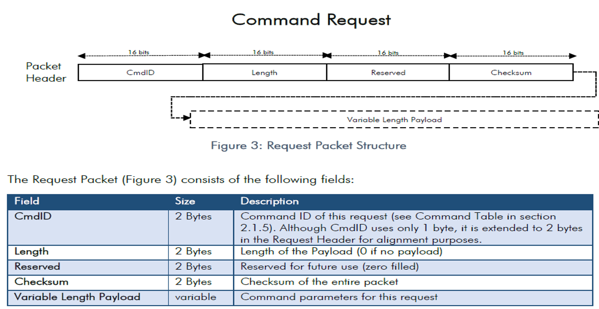
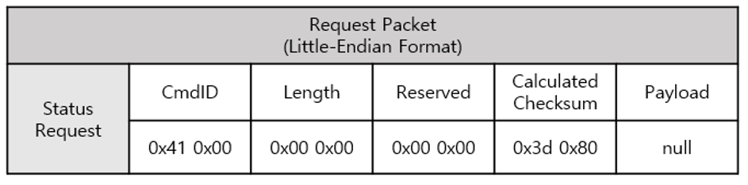
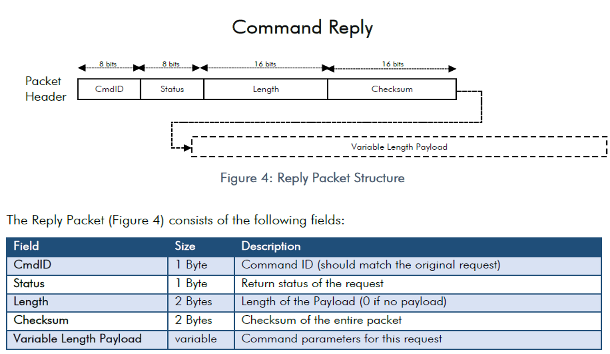
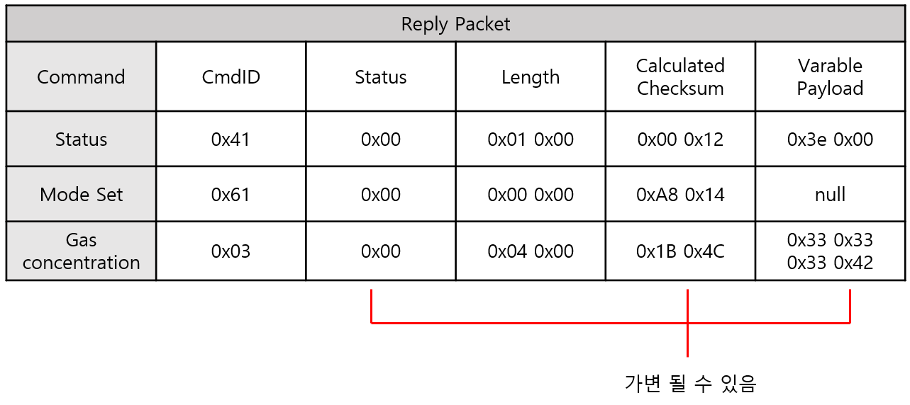
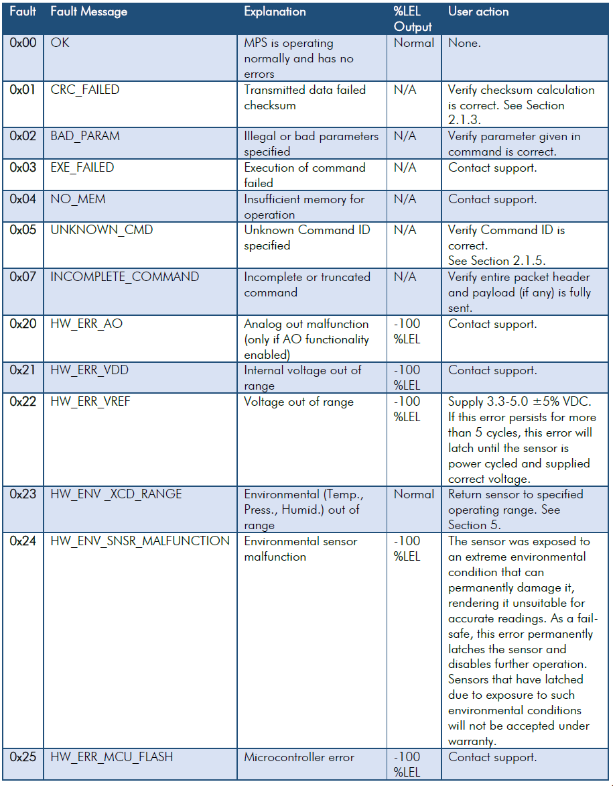
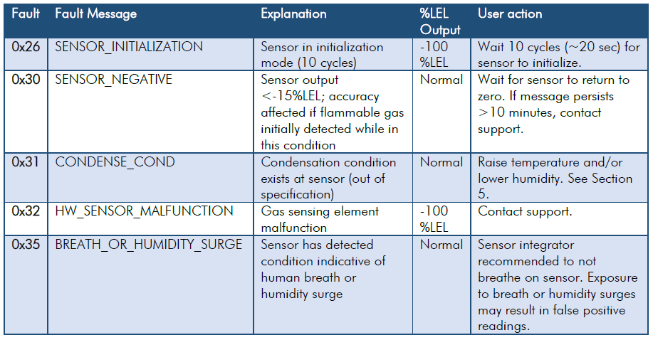
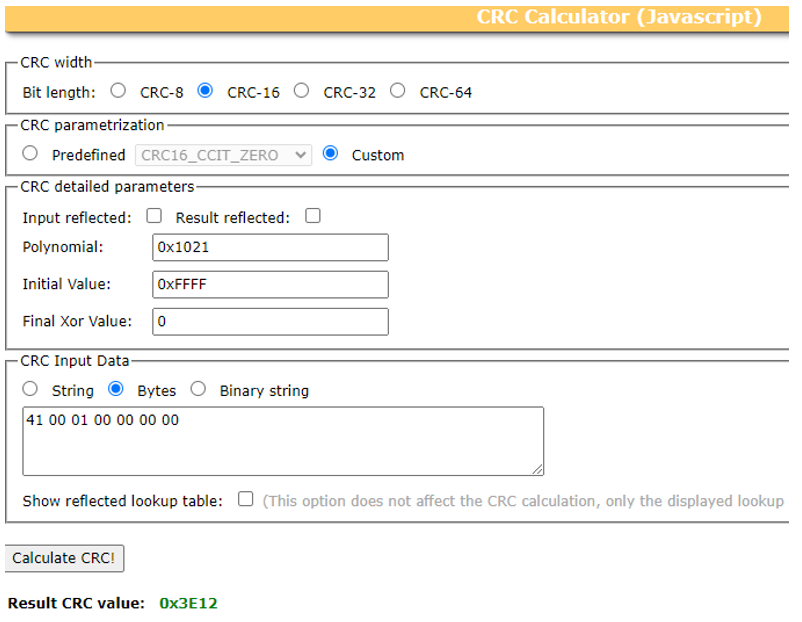
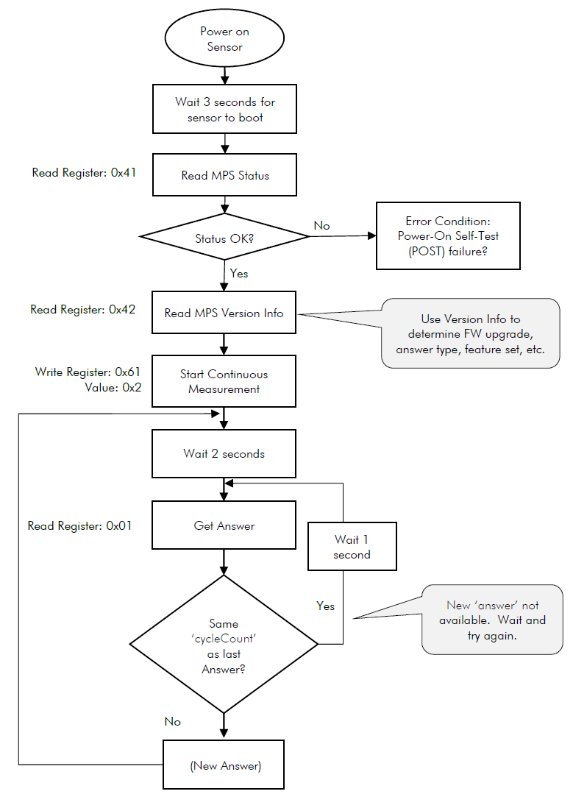

# 통신프로토콜

* UART 설정

|     PARAMETER     |    TYP    |
| :---------------: | :-------: |
| Baud Rate (Fixed) | 38400 bps |
|     Data Bits     |     8     |
|       Parity      |    None   |
|     Stop Bits     |     1     |
|    Flow Control   |    None   |


* MPS Sensor Data Format 방식 : IEEE 754 Format ( 부동소수점), Little Endian 형식(최하위 바이트(LSB)가 먼저 전송)


### 전체 요청(Request) Command&#x20;

<figure><figcaption></figcaption></figure>

* Payload는 사용에 있어서 전송되는 데이터 자체를 의미함(Header, Checksum, parity bit, 등 제외)


* 요청(Request) Command  Packet 구조

<figure><figcaption></figcaption></figure>

ex) 현재 센서 상태 요청 Command

<figure><figcaption></figcaption></figure>

### 응답(Reply) Command  Packet 구조

<figure><figcaption></figcaption></figure>

ex) 현재 센서 상태 응답(정상일 경우만)&#x20;

<figure><figcaption></figcaption></figure>

ex) 응답 Command 예시(정상일 경우만)&#x20;

<figure><figcaption><p>&#x3C; 상태, 모드 설정, 가스 농도 응답 예시></p></figcaption></figure>

* 센서 Status(상태)값이 변하면 Checksum값이 변함

### < Command rely Status 표 >

<figure><figcaption></figcaption></figure>

<figure><figcaption><p>&#x3C; Command reply Status 표></p></figcaption></figure>

* 가장 빈번하게 발생하는 Command reply Status :

1\.     0x26(센서 초기화): 센서 초기화 시간 최대 20초까지 나타남

2\.     0x35( 호흡 or 습도 급증): 센서를 사람의 호흡이나 습도가 급증하는 환경에 노출되면 센서 값이 정확하게 나오지 않을 수 있음


### Checksum 알고리즘: 16bit CRC CCITT 알고리즘&#x20;

&#x20;  \-  Checksum이란 데이터의 오류를 검사하는데 사용되는 일련의 숫자와 문자

* 다항식 0x1021 (x^(16)+x^(12)+x^5+x )
* 시작 바이트 : 0Xffff
* 전체 패킷(헤더 및 페이로드)에 대해 계산됨, 페이로드가 없으면 헤더만으로 계산
* Checksum을 계산하기 전에 Checksum값은 0x00으로 초기화 &#x20;

참고: Checksum 계산하는 [사이트](http://www.sunshine2k.de/coding/javascript/crc/crc\_js.html)


Ex) 현재 상태 응답 Checksum 계산

<figure><figcaption><p>&#x3C; Checksum 계산 예시 > </p></figcaption></figure>

Checksum 예제 코드

\-> [Sample code](https://nevadanano.com/wp-content/uploads/2022/10/EN-TN-0002-04-MPS-Flammable-Gas-Sensor-Sample-Code.tar.gz)

<details>

<summary>CRC Table Sample code</summary>

```cpp
#include <stdlib.h>
#include <stdint.h>

static uint16_t crc_table[256] = {
  0x0000, 0x1021, 0x2042, 0x3063, 0x4084, 0x50a5, 0x60c6, 0x70e7,
  0x8108, 0x9129, 0xa14a, 0xb16b, 0xc18c, 0xd1ad, 0xe1ce, 0xf1ef,
  0x1231, 0x0210, 0x3273, 0x2252, 0x52b5, 0x4294, 0x72f7, 0x62d6,
  0x9339, 0x8318, 0xb37b, 0xa35a, 0xd3bd, 0xc39c, 0xf3ff, 0xe3de,
  0x2462, 0x3443, 0x0420, 0x1401, 0x64e6, 0x74c7, 0x44a4, 0x5485,
  0xa56a, 0xb54b, 0x8528, 0x9509, 0xe5ee, 0xf5cf, 0xc5ac, 0xd58d,
  0x3653, 0x2672, 0x1611, 0x0630, 0x76d7, 0x66f6, 0x5695, 0x46b4,
  0xb75b, 0xa77a, 0x9719, 0x8738, 0xf7df, 0xe7fe, 0xd79d, 0xc7bc,
  0x48c4, 0x58e5, 0x6886, 0x78a7, 0x0840, 0x1861, 0x2802, 0x3823,
  0xc9cc, 0xd9ed, 0xe98e, 0xf9af, 0x8948, 0x9969, 0xa90a, 0xb92b,
  0x5af5, 0x4ad4, 0x7ab7, 0x6a96, 0x1a71, 0x0a50, 0x3a33, 0x2a12,
  0xdbfd, 0xcbdc, 0xfbbf, 0xeb9e, 0x9b79, 0x8b58, 0xbb3b, 0xab1a,
  0x6ca6, 0x7c87, 0x4ce4, 0x5cc5, 0x2c22, 0x3c03, 0x0c60, 0x1c41,
  0xedae, 0xfd8f, 0xcdec, 0xddcd, 0xad2a, 0xbd0b, 0x8d68, 0x9d49,
  0x7e97, 0x6eb6, 0x5ed5, 0x4ef4, 0x3e13, 0x2e32, 0x1e51, 0x0e70,
  0xff9f, 0xefbe, 0xdfdd, 0xcffc, 0xbf1b, 0xaf3a, 0x9f59, 0x8f78,
  0x9188, 0x81a9, 0xb1ca, 0xa1eb, 0xd10c, 0xc12d, 0xf14e, 0xe16f,
  0x1080, 0x00a1, 0x30c2, 0x20e3, 0x5004, 0x4025, 0x7046, 0x6067,
  0x83b9, 0x9398, 0xa3fb, 0xb3da, 0xc33d, 0xd31c, 0xe37f, 0xf35e,
  0x02b1, 0x1290, 0x22f3, 0x32d2, 0x4235, 0x5214, 0x6277, 0x7256,
  0xb5ea, 0xa5cb, 0x95a8, 0x8589, 0xf56e, 0xe54f, 0xd52c, 0xc50d,
  0x34e2, 0x24c3, 0x14a0, 0x0481, 0x7466, 0x6447, 0x5424, 0x4405,
  0xa7db, 0xb7fa, 0x8799, 0x97b8, 0xe75f, 0xf77e, 0xc71d, 0xd73c,
  0x26d3, 0x36f2, 0x0691, 0x16b0, 0x6657, 0x7676, 0x4615, 0x5634,
  0xd94c, 0xc96d, 0xf90e, 0xe92f, 0x99c8, 0x89e9, 0xb98a, 0xa9ab,
  0x5844, 0x4865, 0x7806, 0x6827, 0x18c0, 0x08e1, 0x3882, 0x28a3,
  0xcb7d, 0xdb5c, 0xeb3f, 0xfb1e, 0x8bf9, 0x9bd8, 0xabbb, 0xbb9a,
  0x4a75, 0x5a54, 0x6a37, 0x7a16, 0x0af1, 0x1ad0, 0x2ab3, 0x3a92,
  0xfd2e, 0xed0f, 0xdd6c, 0xcd4d, 0xbdaa, 0xad8b, 0x9de8, 0x8dc9,
  0x7c26, 0x6c07, 0x5c64, 0x4c45, 0x3ca2, 0x2c83, 0x1ce0, 0x0cc1,
  0xef1f, 0xff3e, 0xcf5d, 0xdf7c, 0xaf9b, 0xbfba, 0x8fd9, 0x9ff8,
  0x6e17, 0x7e36, 0x4e55, 0x5e74, 0x2e93, 0x3eb2, 0x0ed1, 0x1ef0,
};

uint16_t crc_generate(uint8_t *buffer, size_t length, uint16_t startValue ) {
  uint16_t crc;
  uint8_t *p;
  int ii;

  crc = startValue;

  for(p = buffer, ii = 0; ii < length; ii++) {
    crc = (crc << 8) ^ crc_table[(crc >> 8) ^ *p];
    p++;
  }

  return crc;

}
```

</details>

### 초기화 및 측정 Sequence

1\.     센서 전원은 켠 후 센서가 부팅될 때까지 기다림(\~3초)

2\.     센서 상태 확인(0x41 Command) – 초기화 완료(0x00)

3\.     센서 상태 확인이 완료되면 연속 측정 모드로 설정(0x61 Command ISO 규격 권장)

4\.     첫번째 측정이 완료될 때까지 2초 기다림


<figure><figcaption></figcaption></figure>

### 가스 농도 값 읽기


[undefined.md](undefined.md)



