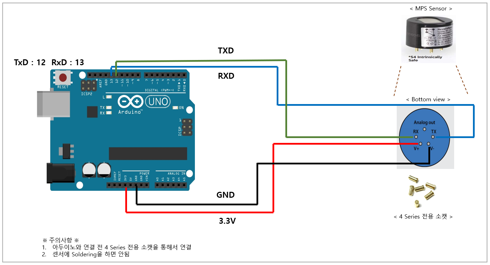
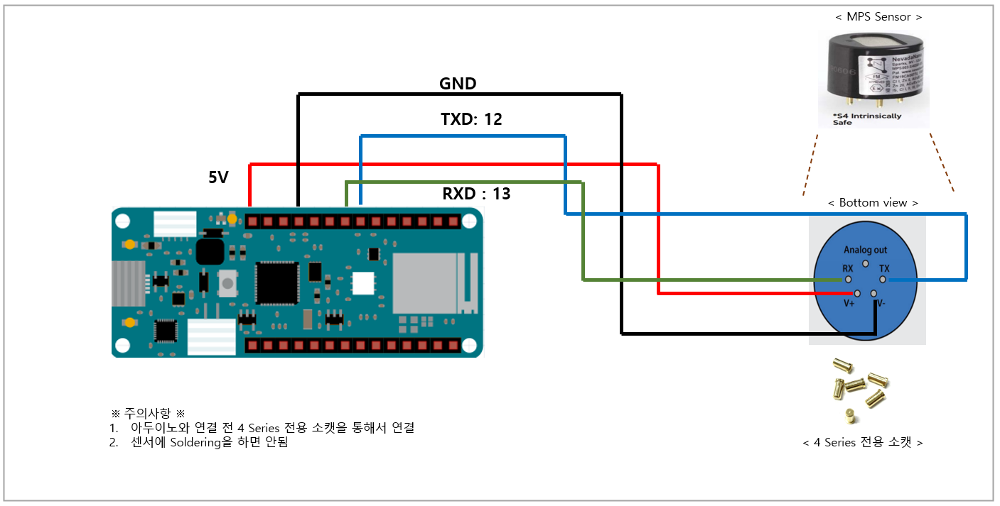
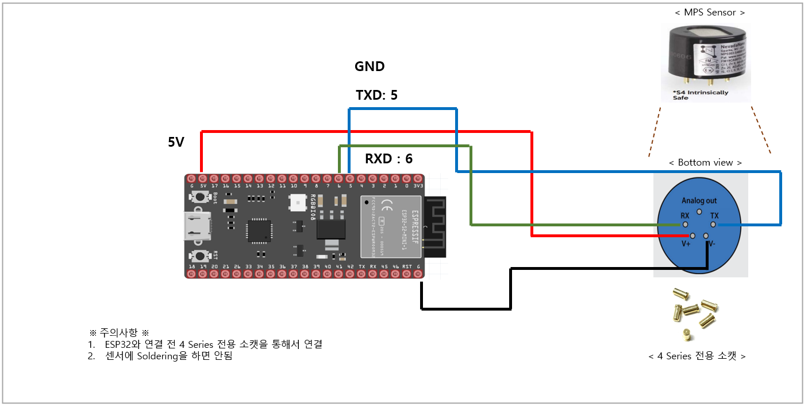
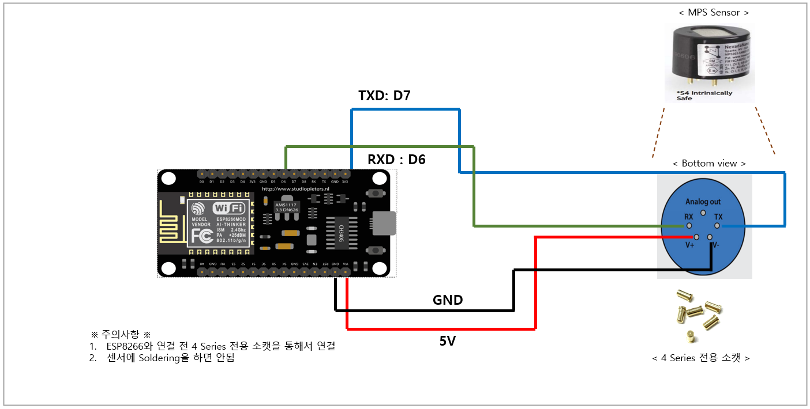

# 디바이스 연결 방법

* Arduino Uno, Arduino mkr 1010, esp32-s2, esp8266와 MPS Gas Sensor의 연결 방법&#x20;



<figure><figcaption></figcaption></figure>



<figure><figcaption></figcaption></figure>



<figure><figcaption></figcaption></figure>



<figure><figcaption></figcaption></figure>



