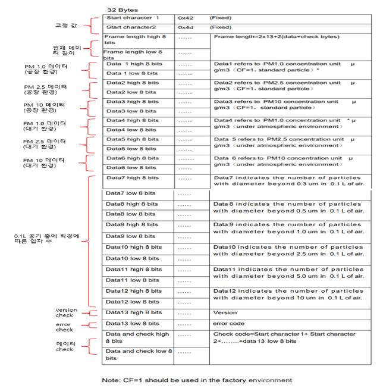
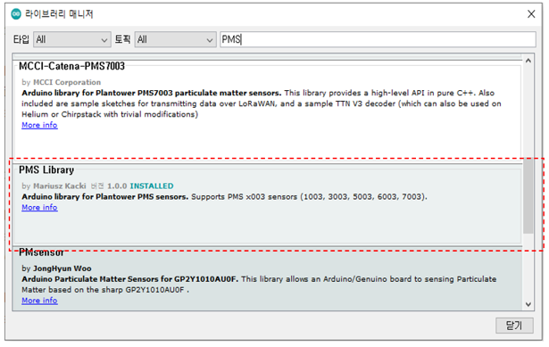
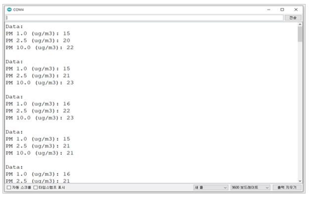
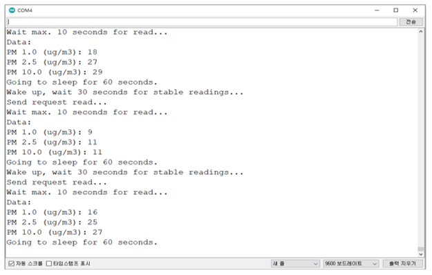

# UART

_UART 통신 프로토콜_

_적용 모델: PMS A003A, PMS A003C, PMS 7003, PMS 7003M, PMS 5003, PMS 9003M_


## UART 설정

|     PARAMETER     |    TYP   |
| :---------------: | :------: |
| Baud Rate (Fixed) | 9600 bps |
|     Data Bits     |     8    |
|       Parity      |   None   |
|     Stop Bits     |     1    |
|    Flow Control   |   None   |


## UART mode

| mode         | Description                 |
| ------------ | --------------------------- |
| Active mode  | 데이터를 연속적으로 보내주는 모드. 기본 설정 값 |
| Passive mode | 사용자의 요청이 있을 때만 데이터를 보내주는 모드 |
| Sleep mode   | 절전 모드                       |


## UART command

| Command                                    | Data 1 | Data 2 | Data 3 | Data 4 | Data 5 | Data 6 | Data 7 |
| ------------------------------------------ | ------ | ------ | ------ | ------ | ------ | ------ | ------ |
| Active                                     | 0x42   | 0x4d   | 0xe1   | 0x00   | 0x01   | 0x01   | 0x71   |
| Passive                                    | 0x42   | 0x4d   | 0xe1   | 0x00   | 0x00   | 0x01   | 0x70   |
| <p>Data request</p><p>(Passive status)</p> | 0x42   | 0x4d   | 0xe2   | 0x00   | 0x00   | 0x01   | 0x71   |
| sleep                                      | 0x42   | 0x4d   | 0xe4   | 0x00   | 0x00   | 0x01   | 0x73   |
| Wake up                                    | 0x42   | 0x4d   | 0xe4   | 0x00   | 0x01   | 0x01   | 0x74   |


## Sensor response interface protocol

<figure><figcaption></figcaption></figure>

## 모드 설정 및 미세먼지 농도 읽기&#x20;

* 사용 라이브러리: SoftwareSerial, PMS
* PMS7003을 사용하여 예제 code 작성

<figure><figcaption></figcaption></figure>



```cpp
#include "PMS.h"
#include <SoftwareSerial.h>
SoftwareSerial mySerial(12, 13); //Uno Rx Tx (12 13) = SoftwareSerial

PMS pms(mySerial);
PMS::DATA data;

void setup()
{
  Serial.begin(9600);
  mySerial.begin(9600);  
}

void loop()
{
  if (pms.read(data))
  {
    Serial.println("Data:");

    Serial.print("PM 1.0 (ug/m3): ");
    Serial.println(data.PM_AE_UG_1_0);

    Serial.print("PM 2.5 (ug/m3): ");
    Serial.println(data.PM_AE_UG_2_5);

    Serial.print("PM 10.0 (ug/m3): ");
    Serial.println(data.PM_AE_UG_10_0);

    Serial.println();
  }
}
```


* 시리얼 모니터

<figure><figcaption></figcaption></figure>



```cpp
#include "PMS.h"
#include <SoftwareSerial.h>
SoftwareSerial mySerial(12, 13); //Uno Rx Tx (12 13) = SoftwareSerial

PMS pms(mySerial);
PMS::DATA data;

void setup()
{
  Serial.begin(9600);   
  mySerial.begin(9600);  
  pms.passiveMode();    // Switch to passive mode
}

void loop()
{
  Serial.println("Wake up, wait 30 seconds for stable readings...");
  pms.wakeUp();
  delay(30000);

  Serial.println("Send request read...");
  pms.requestRead();

  Serial.println("Wait max. 10 seconds for read...");
  if (pms.read(data, 10000))
  {
    Serial.println("Data:");

    Serial.print("PM 1.0 (ug/m3): ");
    Serial.println(data.PM_AE_UG_1_0);

    Serial.print("PM 2.5 (ug/m3): ");
    Serial.println(data.PM_AE_UG_2_5);

    Serial.print("PM 10.0 (ug/m3): ");
    Serial.println(data.PM_AE_UG_10_0);
  }
  else
  {
    Serial.println("No data.");
  }

  Serial.println("Going to sleep for 60 seconds.");
  pms.sleep();
  delay(60000);
}

```


* 시리얼 모니터

<figure><figcaption></figcaption></figure>




