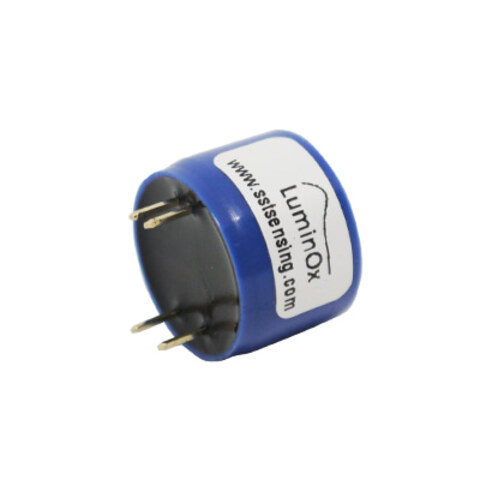
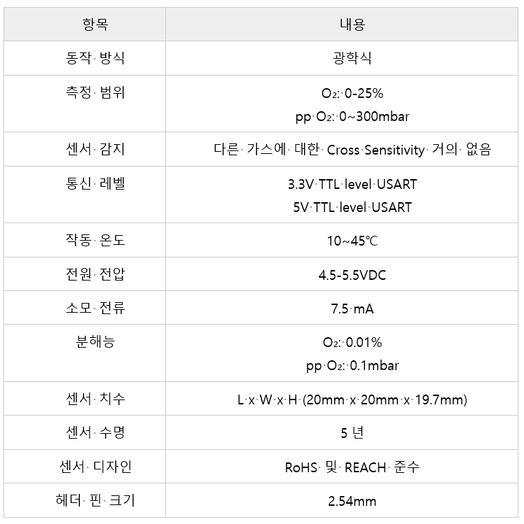
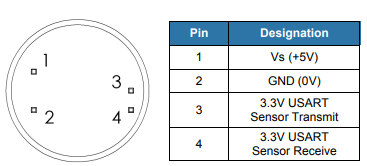
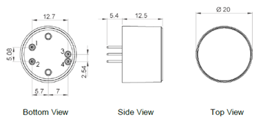

# LOX\_02\_S

<figure><figcaption></figcaption></figure>

## 특징

* 내장형 압력 센서, 디지털 출력이 있는 형광 기반의 소형 산소 센서
* 광범위한 환경 범위에서도 산소만 정확한 측정 및 작동
* 크기가 작아 공간이 제한된 애플리케이션에서도 이상적
* RoHS 및 REACH 준수
* 저전력 긴 수명


## 애플리케이션

* 교통
* 텔레콤
* 산업
* 비행
* 선박
* 의료

## 사양

<figure><figcaption></figcaption></figure>

## 제품 크기 및 핀 특성

<figure><figcaption></figcaption></figure>

<figure><figcaption></figcaption></figure>

#### [Datasheet](https://sstsensing.com/wp-content/uploads/2018/01/DS0144rev2\_LOX-02-S.pdf)


## 디바이스 연결 방법

## 통신 프로토콜

## 아두이노 연결 방법 및 예제


<figure><figcaption></figcaption></figure>

<figure><figcaption></figcaption></figure>

## 예제 Code(Arduino Base)


```cpp
#include <SoftwareSerial.h>
SoftwareSerial mySerial(12, 13);
 
void setup() {
  Serial.begin(9600);
  mySerial.begin(9600); //Uno Rx Tx (12, 13) = mySerial
}
 
void loop() {
//수신받은 데이터가 0 초과, 즉 데이터가 존재한다면           
 if (mySerial.available())  {  //코드수행   
    Serial.write(mySerial.read());
    }
}
```


**Serial Monitor**

<figure><figcaption></figcaption></figure>

\* O = 현재 산소분압(PPO₂)값\
\* T = 현재 온도값\
\* P = 현재 기압값\
\* % = 현재 O₂ 퍼센트 값\
\* e = 센서 상태(“e 0000” = 센서상태 좋음, “e xxxx” = [SST sensing](https://sstsensing.com/)에 문의)

**Live Graph Link**

<figure><figcaption></figcaption></figure>


